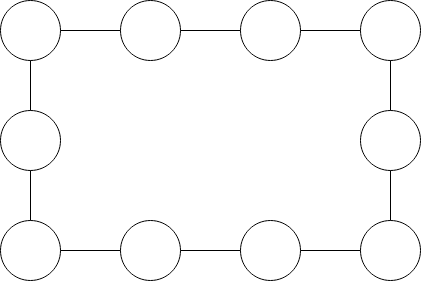
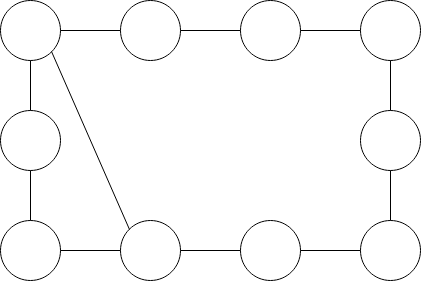
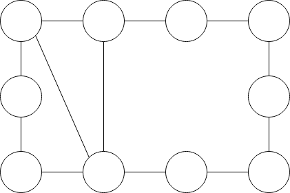
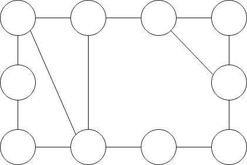

[Contest IV](https://www.codepit.io/#/contest/5ac7a622636fa800962e6f63/view)
==========

[Problema A](https://uva.onlinejudge.org/index.php?option=com_onlinejudge&Itemid=8&page=show_problem&problem=227)
----------

O desenho do problema pode ser enxergado como um grafo, onde cada **1** dos **5** pontos é um nó e as linhas entre eles são as arestas. No caso, o grafo teria as arestas **(1, 2)**, **(1, 3)**, **(1, 5)**, **(2, 3)** etc.

Então, basicamente, o problema pede para encontrarmos todas as travessias em que começamos do nó **1**, terminamos, também, no nó **1** e utilizamos todas as arestas exatamente **1** vez.

O problema pede para imprimirmos as respostas como sequências númericas, onde os nós são visitados seguindo a ordem da sequência. Como o grafo do desenho tem exatamente **8** arestas, o número de elementos em cada sequência númerica será **9**.

Se conseguirmos criar uma função **valid(S)** que recebe uma sequência númerica **S** de **9** elementos e nos diz se a sequência é válida ou não, então podemos gerar todas as sequências possíveis e pegar somente as válidas; isto é, geraríamos as sequências do tipo: **{111111111, 111111112, 111111113, ..., 211111111, 211111112, ..., 555555555}** e verificaríamos quais delas são válidas.

Se a complexidade de **valid(S)** for **O(X)**, então a complexidade final do algoritmo será **O(X * 5^9)**, pois existem apenas **5^9** sequências númericas como as citadas acima.

Supondo que um conjunto **E** de arestas do grafo original foi criado, a função **valid(S)** pode ser definida da seguinte maneira:

 - Pra dois elementos adjacentes **A** e **B** em **S**, se a aresta **(A, B)** não existir em **E**, então a sequência **S** é inválida
 - Pra dois elementos adjacentes **A** e **B** em **S**, se a aresta **(A, B)** existir em **E** mas for utilizada mais de uma vez (isto é, se **A** e **B** aparecem mais de **1** vez lado a lado em **S**), então a sequência **S** é inválida
 - Caso contrário, a sequência **S** é válida

O último passo é gerar todas as sequências possíveis: isso pode ser feito utilizando a técnica [backtracking](https://en.wikipedia.org/wiki/Backtracking). Por alto nível, o funcionamento é: primeiro, colocamos o elemento **1** em _buffer_ temporário; chamamos, então, a função de _backtracking_ para esse _buffer_ para que ela calcule todos as sequências da forma **{1, x, x, x, ..., x}**. Depois, colocamos o elemento **1** no _buffer_ novamente e chamamos a função _backtracking_ para calcular todas as sequências da forma **{1, 1, x, x, ..., x}**; depois que as sequências desse tipo forem calculadas, damos _pop_ no segundo **1** colocado e colocamos o elemento **2** no seu lugar e chamamos a função _backtracking_ para gerar todas as sequências da forma **{1, 2, x, x, ..., x}**; depois, damos _pop_ no **2**, colocamos o **3** em seu lugar e chamamos a função para calcular as sequências da forma **{1, 3, x, x, ..., x}** e por aí vai. Esse procedimento é recursivo, então a função está sempre executando o mesmo procedimento até que encontre um caso base, que é quando a sequência no _buffer_ atual já está com tamanho **9**.

A título de curiosidade, uma travessia em um grafo começando de um nó **X**, terminando no mesmo nó **X** e visitando todas as arestas uma única vez é chamada de [Ciclo Euleriano](https://en.wikipedia.org/wiki/Eulerian_path), estrutura essa bastante interessante e cheia de propriedades elegantes.

Abaixo segue um código **C++** aceito nesse problema como sugestão de implementação:
```cpp
#include <bits/stdc++.h>

using namespace std;

const int ELEMENTS_IN_A_ORDER = 9;
const int NODES = 5;

set< pair<int, int> > edges;

void create_edges() {
	edges.emplace(1, 2);
	edges.emplace(1, 3);
	edges.emplace(1, 5);

	edges.emplace(2, 3);
	edges.emplace(2, 5);

	edges.emplace(3, 4);
	edges.emplace(3, 5);

	edges.emplace(4, 5);
}

void generate(vector<int> &state, vector< vector<int> > &orders) {
	if((int) state.size() == ELEMENTS_IN_A_ORDER) {
		orders.push_back(state);
		return;
	}

	for(int i = 1; i <= NODES; i++) {
		state.push_back(i);
		generate(state, orders);
		state.pop_back();
	}
}

vector< vector<int> > generate_orders() {
	vector<int> state;
	vector< vector<int> > orders;

	state.push_back(1);
	generate(state, orders);

	return orders;
}

bool valid(const vector<int> &order) {
	int n = order.size();

	set< pair<int, int> > used_edges;

	for(int i = 1; i < n; i++) {
		int minimum = min(order[i - 1], order[i]);
		int maximum = max(order[i - 1], order[i]);

		pair<int, int> edge = make_pair(minimum, maximum);

		if(!edges.count(edge) || used_edges.count(edge)) {
			return false;
		}

		used_edges.insert(edge);
	}
	
	return true;
}

int main() {
	ios_base::sync_with_stdio(false);

	create_edges();

	vector< vector<int> > orders = generate_orders();

	for(const auto &order : orders) {
		if(valid(order)) {
			for(const auto &element : order) {
				cout << element;
			}
			cout << '\n';
		}
	}

	return 0;
}
```

Uma outra visão que podemos ter também utilizando a técnica de **backtracking** é realizar passos seguros de forma que apenas as soluções terá o tamanho 9. Para isso podemos usar o algoritmo de [**DFS**](https://pt.wikipedia.org/wiki/Busca_em_profundidade) com a adaptação de excluirmos os nós visitados a fim de evitar os ciclos do grafo.


```c++
int grafo[6][6];

int total;
vector<int> resultado;


void dfs(int node){

	// adicionamos esse nó ao resultado
	total++;
	resultado.push_back(node);
	
	//caso o número de nós no resultado for 9 ele é um resultado válido
	if(total==9){
		for(auto each : resultado){
			cout << each;
		}
		cout << endl;
	}

	// passamos em cada filho do nó em questão
	for(int i =1; i<6; ++i){
	
		if(grafo[node][i]){
			
			// excluimos o nó a fim de evitar ciclos que deixariam
			// o nosso algoritmo em looping
			grafo[node][i]=grafo[i][node] =0;
			
			// examinamos se o filho cabe ou não no resultado
			dfs(i);
			
			// recolocamos o nó para continuarmos as próximas interações
			grafo[node][i]=grafo[i][node] =1;
		}
	}
	
	// retiramos esse nó do resultado
	total--;
	resultado.pop_back();
}

```

[Problema B](https://uva.onlinejudge.org/index.php?option=onlinejudge&page=show_problem&problem=1242)
----------

No problema são dados vários anéis que ficam grudados uns aos outros caso se encostem, nossa tarefa é descobrir qual o maior conjunto de aneis grudados juntos.

Cada anél é representado por uma círcunferência, pontanto para descobrir se dois aneis estão grudados basta verificar se existe intersecção entre as circunferências que representam esses anéis.

Existe uma intersecção entre as círcunferências A e B se, e somente se, a distância entre os centros de A e B for menor ou igual à soma de seus raios e nenhuma das círcunferência está contida na outra (raio(A) + raio(B) >= dist(centro(A), centro(B)) && dist(centro(A), centro(B)) >= modulo(raio(A) - raio(B))).

É possível abstrair este problema com um grafo, onde cada anél é um vértice, os anéis grudados são ligados por arestas e cada conjunto de aneis grudados é uma [componente conectada](https://en.wikipedia.org/wiki/Connected_component_%28graph_theory%29).

Podemos enxergar cada anél como uma componente separada inicialmente (componentes contendo um único vértice).

Precisamos agora conectar as componentes. Como o número de aneis é pequeno, é possível verificar se existe intersecção entre cada par de anéis e, caso exista a intersecção, unir as componentes em que esses anéis estão, utilizando [Union Find Disjoint Sets (UFDS)](https://en.wikipedia.org/wiki/Disjoint-set_data_structure), e manter o tamanho de cada componente atualizado após cada união realizada.

Ao final das uniões cada conjunto de anéis grudado será uma componente separada, para obter a resposta para o problema é possível percorrer todos os anéis e verificar o tamanho da componete á qual cada anél pertence, armazenando o maior dos tamanhos.

A complexidade de tempo para verificar se existe intesecção entre dois anéis é constante, utilizando compressão de caminhos as operações da UFDS tem [complexidade amortizada](https://en.wikipedia.org/wiki/Amortized_analysis) constante, com N anéis comparamos cada par de anéis e a quantidade de pares diferentes é N*(N-1) / 2, que assintoticamente é O(N^2), portanto a complexidade de tempo desta solução é O(N^2).

**Implementação em C++:**

```C++
#include <bits/stdc++.h>

using namespace std;

using circle = pair<pair<double, double>,double>;
#define Cx first.first
#define Cy first.second
#define Cr second

const int MAX_N = 105;
int cc[MAX_N]; // representante de cada componente conectada
int sz[MAX_N]; // tamanho de cada componente conectada

int find(int a){
	return cc[a] = a == cc[a] ? a : find(cc[a]);
}

void join(int a, int b){
	sz[find(b)] += sz[find(a)];
	cc[find(a)] = find(b);
}

int main (){
	int n;
	scanf("%d",&n);
	while(n != -1){
		vector<circle> ring;
		for(int i = 0; i < n; i++){
			double x, y, r;
			scanf("%lf %lf %lf", &x, &y, &r);
			ring.push_back({{x, y}, r});
			cc[i] = i;
			sz[i] = 1;
		}

		for(int i = 0; i < n; i++){
			for(int j = i + 1; j < n; j++){
				if(find(i) != find(j)){
					double dist = hypot(ring[i].Cx - ring[j].Cx, ring[i].Cy - ring[j].Cy);
					if(ring[i].Cr + ring[j].Cr >= dist && dist >= fabs(ring[i].Cr - ring[j].Cr)){
						join(i, j);
					}
				}
			}
		}

		int ans = 0;
		for(int i = 0; i < n; i++){
			ans = max(ans, sz[i]);
		}

		printf("The largest component contains %d ring%s\n",ans, ans == 1 ? "." : "s.");

		scanf("%d",&n);
	}
	return 0;
} 
```

[Problema C](https://uva.onlinejudge.org/index.php?option=com_onlinejudge&Itemid=8&page=show_problem&problem=1661)
---------------

A solução deste problema é, basicamente, a implementação do [teorema de Erdős–Gallai](https://en.wikipedia.org/wiki/Erd%C5%91s%E2%80%93Gallai_theorem).

Depois de ordenar os _degrees_ de forma decrescente, basta checar a condição pra cada um dos _degrees_ **i** de **1** a **N**.

A primeira parte da equação (isto é, a soma dos primeiros **i** _degrees_) é fácil de obter: basta manter uma variável e ir somando os valores dos _degrees_ durante a iteração.

A segunda parte (isto é, o **i * (i - 1)**) é apenas uma multiplicação.  

A terceira parte é um pouco mais chata de conseguir. Se a soma não levasse a função **min** em conta, poderíamos apenas utilizar [soma de prefixos pra obter a somar dos _degrees_ no range **[i + 1, N]** em **O(1)**](https://cs.stackexchange.com/questions/25800/can-we-compute-the-sum-of-a-range-of-entries-in-o1-time). Como não é o caso, faremos uma pequena alteração: pegaremos, inicialmente, a soma dos elemenos no range **[i + 1, N]** e, depois, encontraremos quantos elementos no range **[i + 1, N]** são maiores que **i** e consideraremos todos como **i**. Isso pode ser feito com busca binária, já que o _array_ de _degrees_ está ordenado de forma não decrescente. Após encontrados os índices do _range_ de elementos que são maiores que **i**, basta subtrair sua soma (também utilizando soma de prefixos) da soma original e, supondo que existam **X** elementos nesse _range_, adicionar **X * i** na soma, para supor que todos esses **X** elementos são **i**.

A complexidade final do algoritmo é **O(N * log N)** porque para cada **i** de **1** a **N** fazemos uma busca binária, que tem complexidade **O(log N)**.

Abaixo segue um código **C++** aceito nesse problema como sugestão de implementação:
```cpp
#include <bits/stdc++.h>

using namespace std;

const int MAX = 1e4 + 5;
int degree[MAX], prefix_sum[MAX];
int n;

inline int range_sum(int left, int right) {
	return prefix_sum[right] - prefix_sum[left - 1];
}

int special_sum(int left, int right) {
	int k = left - 1;
	int sum = range_sum(left, right);
	
	int L = left, R = right;
	int until = -1;
	while(L <= R) {
		int M = (L + R) / 2;

		if(degree[M] > k) {
			until = M;
			L = M + 1;
		}
		else {
			R = M - 1;
		}
	}

	if(until != -1) {
		int len = until - left + 1;
		sum -= range_sum(left, until);
		sum += k * len;
	}

	return sum;
}

int main() {
	ios_base::sync_with_stdio(false);

	while(cin >> n, n != 0) {
		int degree_sum = 0;
		for(int i = 1; i <= n; i++) {
			cin >> degree[i];
			degree_sum += degree[i];
		}

		if(degree_sum & 1) {
			cout << "Not possible" << '\n';
			continue;
		}

		sort(degree + 1, degree + n + 1, greater<int>()); // ordena decrescente

		for(int i = 1; i <= n; i++) {
			prefix_sum[i] = prefix_sum[i - 1] + degree[i];
		}

		bool ok = true;
		int sum = 0;
		for(int i = 1; i <= n; i++) {
			sum += degree[i];

			if(sum > i * (i - 1) + special_sum(i + 1, n)) {
				ok = false;
				break;
			}
		}

		cout << (ok ? "Possible" : "Not possible") << '\n';
	}

	return 0;
}

```

[Problema D](https://uva.onlinejudge.org/index.php?option=onlinejudge&page=show_problem&problem=1119)
----------

O problema simplesmente nos dá um grafo planar como _input_ e nos pede para contar as faces do mesmo.

O _input_ é composto por **N** nós e **E** arestas, os quais epresentam o grafo planar. Os limites não são dados (thanks, UVA), mas isso não fará diferença pois a solução será linear.

Em geral, na tentativa de resolução de um problema, é útil desenhar/criar alguns casos para analisar como a resposta é dada em relação ao _input_. Por exemplo, veja o grafo composto por um ciclo simples a seguir:


É fácil observar que ele possui o mesmo número de nós e arestas e o número de faces é 1 (esqueçamos a "face" de de fora, por enquanto).

Agora, analise as imagens a seguir e perceba como a quantidade de faces muda a cada adição de aresta:







Sim, pra cada (e qualquer) aresta colocada, o número de faces cresce em 1. Isso acontece pois a face é dividida em duas outras faces quando qualquer aresta passa por ela.

Já sabemos, então, que o número **V** de faces cresce linearmente em relação ao número de arestas  **E**; isto é, sabemos que **V = E - X**, para algum **X** que não sabemos ainda o que é. A única variável restante a analisar é o número de nós **N**: se analisarmos a primeira imagem, vemos que **V = 1** e **N = E = 10**, logo **1 = 10 - X** e **X = 9**, que é **N - 1**. Então, finalizamos com **V = E - N + 1**. Isto é, para saber o número de faces de um grafo planar, basta saber o número de nós e arestas no grafo.

O único porém é que a fórmula descrita acima é válida para um [componente conectado](https://en.wikipedia.org/wiki/Connected_component_(graph_theory)). Portanto, para calcular a resposta final, basta calcular o número de faces de cada componente conectado, somar esses valores e somar 1 ao final de tudo para computar a face "externa" que o problema leva em conta.

A solução tem complexidade final **O(N + E)**, pois cada nó e cada aresta vão ser visitados no máximo uma vez dentro das DFS. 

Como nota de curiosidade, essa solução é basicamente um caso da [característica de Euler](https://en.wikipedia.org/wiki/Euler_characteristic).

Abaixo segue um código C++, utilizando [DFS](https://en.wikipedia.org/wiki/Depth-first_search) para contar a quantidade de arestas e nós dos componentes conectados, aceito nesse problema como sugestão de implementação:

```cpp
#include <bits/stdc++.h>

using namespace std;

map<char, vector<char>> adj;
set<char> visited;
int N, E;

void dfs(int node, int &nodes, int &edges) {
	visited.insert(node);

	nodes++;
	edges += adj[node].size();

	for(const auto &neighbour : adj[node]) {
		if(!visited.count(neighbour)) {
			dfs(neighbour, nodes, edges);
		}
	}
}

int main() {
	ios_base::sync_with_stdio(false);

	while(cin >> N >> E) {
		adj.clear();
		visited.clear();

		for(int i = 0; i < E; i++) {
			char A, B;
			cin >> A >> B;

			adj[A].push_back(B);
			adj[B].push_back(A);
		}

		int answer = 1;
		for(const auto &each : adj) {
			if(!visited.count(each.first)) {
				int nodes = 0, edges = 0;

				dfs(each.first, nodes, edges);
				edges /= 2;

				answer += edges - nodes + 1;
			}
		}	

		cout << answer << '\n';
	}

	return 0;
}

```

[Problema E](https://uva.onlinejudge.org/index.php?option=com_onlinejudge&Itemid=8&page=show_problem&problem=2737)
----------

Considere um grupo de pessoas P = {p1, p2, ..., pn} e que cada pessoa pi possui uma dívida ci. É fácil ver que elas conseguem pagar as dívidas entre si se c1+c2+...+cn=0. Portanto, basta analisar os diferentes grupos de amigos existentes e verificar se a soma das dívidas de cada um deles resulta em zero. Duas técnicas diferentes podem ser utilizadas para implementar essa solução:

### Disjoint Set (Union-Find)

Criar uma estrutura Union Find para o conjunto P. Inicialmente, todos os amigos possuem nenhuma amizade entre si. Após ler um laço de amizade entre uma pessoa pi e pj, aplicar a união entre elas. Finalmente, deve-se passar por todos os conjuntos montados e verificar se a soma das dívidas resulta em 0 em cada um deles.

**Implementação em C++:**

```C++
#include <bits/stdc++.h>
using namespace std;

const int MAX = 10001;
int pset[MAX], cost[MAX];

int find_set(int i)
{
	return pset[i] == i ? i : pset[i] = find_set(pset[i]);
}

void union_sets(int i, int j)
{
	int pi = find_set(i), pj = find_set(j);
	if(pi != pj)
		pset[pi] = pj;
}

int main()
{
	int N;
	cin >> N;
	while(N--)
	{
		int n, m;
		cin >> n >> m;
		for(int i = 0; i < n; i++)
		{
			cin >> cost[i];
			pset[i] = i;
		}
		for(int i = 0; i < m; i++)
		{
			int x, y;
			cin >> x >> y;
			union_sets(x, y);
		}
		map<int, int> sum;
		for(int i = 0; i < n; i++)
			sum[find_set(i)] += cost[i];
		bool ok = 1;
		for(auto i : sum)
			ok &= i.second == 0;
		cout << (ok ? "POSSIBLE" : "IMPOSSIBLE") << endl;
	}

	return 0;
}
```

### Busca em profundidade (DFS)

Outra forma de solucionar o problema é aplicar uma DFS em um grafo cujos nós representam os amigos e as arestas os laços de amizades entre eles. Logo, basta rodar uma DFS para cada nó não visitado e verificar se a soma das dívidas resulta em 0.

**Implementação em C++:**

```C++
#include <bits/stdc++.h>
using namespace std;

const int MAX = 10001;

bool visited[MAX];
int cost[MAX];
int sum = 0;

void dfs(int u, vector<int> adj[])
{
	visited[u] = 1;
	sum += cost[u];
	for(auto i : adj[u])
		if(!visited[i])
			dfs(i, adj);
}

int main()
{
	int N;
	cin >> N;
	while(N--)
	{
		int n, m;
		cin >> n >> m;
		for(int i = 0; i < n; i++)
			cin >> cost[i];
		vector<int> adj[n];
		for(int i = 0; i < m; i++)
		{
			int x, y;
			cin >> x >> y;
			adj[x].push_back(y);
			adj[y].push_back(x);
		}
		memset(visited, 0, n);
		bool ok = 1;
		for(int i = 0; i < n; i++)
			if(!visited[i])
			{
				dfs(i, adj);
				ok &= sum == 0;
			}
		cout << (ok ? "POSSIBLE" : "IMPOSSIBLE") << endl;
	}

	return 0;
}
```

[Problema F](https://uva.onlinejudge.org/index.php?option=com_onlinejudge&Itemid=8&page=show_problem&problem=3638)
------------

O contexto do problema explica que uma espécie de pneumonia vem contaminando boa parte da população mundial. Uma universidade se deu conta do risco e, por isso, tem interesse de analisar os grupos de estudo formados por alguns alunos, pois a taxa de contaminação da doença é elevada. Em específico, se um aluno _X_ é suspeito de ter a doença, então um aluno _Y_ presente em algum grupo de estudo que _X_ também está presente também é. Dada essa definição, a universidade tem interesse em saber quantos alunos são suspeitos de ter a doença, dado que o aluno _0_ é um suspeito.

O _input_ é composto por _1 <= N <= 10^4_ alunos e _0 <= M <= 500_ grupos de estudo.

A primeira observação simples a se fazer é que a suspeita de alunos é transitiva; isto é: se um aluno _X_ é suspeito e um aluno _Y_ está em algum grupo de estudo que _X_ está, então _Y_ passa a ser suspeito. Logo após, se o aluno _Z_ está em algum grupo de estudo que _Y_ está mas _X_ não, _Z_ passa a ser suspeito do mesmo jeito, pois _Y_ foi considerado suspeito por estar em um grupo com _X_.

Essa primeira observação pode ser um bom incentivo para enxergarmos as estruturas lógicas do problema como um grafo. Isto é, modelamos os alunos comos nós e as arestas entre dois alunos como a presença deles em algum mesmo grupo; em outras palavras, uma aresta existe entre dois alunos caso os dois estejam em um mesmo grupo qualquer.

A outra observação chave é: a única fonte de contaminação é o aluno _0_; ou seja, apenas os alunos presentes no mesmo [componente conectado](https://en.wikipedia.org/wiki/Connected_component_%28graph_theory%29)  que o aluno _0_ estarão infectados. Então, a resposta para o problema é simplesmente o tamanho do componente conectado em que o aluno _0_ está presente.

Com as informações acima, podemos resolver o problema utilizando a estrutura de dados [Union Find Disjoint Sets (UFDS)](https://en.wikipedia.org/wiki/Disjoint-set_data_structure).

Para cada grupo de estudos lido no input, uniremos (criaremos uma aresta, teoricamente) todos os pares de alunos presentes nesse grupo com a função _union_ do UFDS. Se um grupo de estudos lido tem tamanho _S_, então esse passo faria _O(S^2)_ uniões, pois fazemos uma para cada par de alunos presente no grupo. Uma observação simples é: se fixarmos o primeiro aluno desse grupo e unirmos ele com todos os outros, então todos os alunos desse grupo já estarão no mesmo conjunto do UFDS. Então, esse passo pode ser otimizado como citado acima para _O(S)_ uniões.

Se mantermos e atualizarmos um vetor _size_ para guardar os tamanhos do conjuntos do UFDS ao longo das uniões feitas pelas função _union_, basta imprimir _size[set(0)]_ ao final do passo descrito no parágrafo acima como resposta.

A complexidade final do algoritmo é dada pela soma das quantidades de uniões feitas nos grupos. O pior caso é quando todos os _M_ grupos são compostos por todos os _N_ alunos, fazendo com que haja _N_ uniões para cada grupo. Portanto, a complexidade final é _O(NM)_, assumindo que a complexidade da função _union_ é _O(1)_ amortizada. 

Abaixo segue um código C++ aceito nesse problema como sugestão de implementação:
```C++
#include <bits/stdc++.h>

using namespace std;

const int MAX_N = 3e4 + 5;
const int MAX_M = 5e2 + 5;

int pset[MAX_N];
int size[MAX_N];
int n, m;

void reset_UFDS() {
	for(int i = 0; i < n; i++) {
		pset[i] = i;
		size[i] = 1; // o set inicia com tamanho 1, pois apenas i está presente nele inicialmente
	}
}

int find_set(int i) {
	if(pset[i] == i) {
		return i;
	}
	return pset[i] = find_set(pset[i]);
}

void make_union(int i, int j) {
	int i_set = find_set(i);
	int j_set = find_set(j);

	if(i_set != j_set) { 
		size[j_set] += size[i_set];
		pset[i_set] = j_set; // unindo o set de i no set de j
	}
}

int main() {
	ios_base::sync_with_stdio(false);

	while(cin >> n >> m, n | m) {
		reset_UFDS();

		for(int i = 0; i < m; i++) {
			int group_size;
			cin >> group_size;

			vector<int> students(group_size);
			for(int j = 0; j < group_size; j++) {
				cin >> students[j];
			}

			for(int j = 1; j < group_size; j++) {
				make_union(students[0], students[j]);
			}
		}

		cout << size[find_set(0)] << '\n';
	}

	return 0;
}
```
