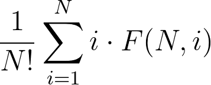

Prova I
==========

Problema A
----------

O problema nos pede pra dizer se é possível criar um grafo com **N** nós de tal forma que cada um dos nós esteja conectado a exatamente **L** outros nós, onde um nó não pode estar conectado consigo mesmo.

A primeira observação chave é: se **L** for maior ou igual a **N**, então é impossível criar qualquer grafo da dita forma, porque um nó só pode se conectar a, no máximo, **N - 1** nós (todos os outros menos ele mesmo).

A observação descrita acima é bem fácil de ser enxergada, mas a partir desse ponto chegar numa solução pode não ser tão simples. Para situações como essa, é bem útil tentar derivar propriedades das estruturas do problema com as informações que já temos; por exemplo, uma pergunta útil que podemos fazer é: "quantas arestas existem em um grafo da forma descrita acima?" Se existem **N** nós e cada um está conectado a exatamente **L** arestas, então a resposta deve ser **(N * L) / 2**; dividimos a expressão **(N * L)** por **2** porque uma aresta está ligada a exatamente **2** nós e, por isso, ela é contada **2** vezes em **(N * L)**.

Bom, se o número total de arestas é **(N * L) / 2**, então **(N * L)** deve ser par, caso contrário teríamos uma aresta pela metade, já que a expressão **(N * L) / 2** resultaria em um número não inteiro. Esta é a segunda observação chave do problema.

Acontece que essas duas condições (**L** ser menor que **N** e **(N * L)** ser par) são suficientes para a existência de um grafo da forma requerida.

Dividamos a prova da afirmação acima em dois casos:
* **N** par:
	1. Se **N** for par, podemos repetir o passo no próximo item **L** vezes para montar um grafo que obedece as propriedades
	2. Escolha **N / 2** pares de nós de tal forma que ainda não exista uma aresta entre os nós de todo e qualquer par e, então, crie uma aresta entre eles
	3. É fácil ver que se esse passo for executado **L** vezes, teremos um grafo aceito
	4. O único jeito de algum desses passos falhar é quando algum nó **i** não consegue formar par com nenhum outro elemento **j**: ou seja, se já existir uma aresta entre eles. Isso nunca acontece porque, pra cada passo, todos os nós têm uma aresta adicionada à sua lista de adjacência, e como já sabemos que **L <= N-1** (primeiríssima observação), então, no começo de qualquer passo, a lista de adjacências de qualquer nó **i** terá, no máximo, tamanho **N-2**, implicando que sempre haverá pelo menos um outro nó **j** para formar par com **i**.
* **N** ímpar:
	1. Se **N** for ímpar, vamos excluir, temporariamente, um nó qualquer **X**
	2. Agora, existe um número par de nós. Vamos repetir **L-1** vezes o passo descrito no item **2** do caso do **N** par
	3. O **L**-ésimo passo será um pouco diferente: formamos **[(N - 1) - L] / 2** pares válidos de nós e criamos arestas entre cada um deles (perceba que **(N - 1) - L** é par). Nisso, exatamente **L** nós (os que não foram escolhidos nos pares formados do período anterior) e o nó **X** ainda não estarão conectados a exatamente **L** outros nós. Para resolver isso, basta conectar **X** a cada um dos **L** nós restantes, já que os mesmos estavam conectados a **L - 1** nós (pelo item **2**).

A complexidade final da solução é **O(1)**.

Abaixo segue um código **C++** aceito nesse problema como sugestão de implementação:
```cpp
#include <bits/stdc++.h>

using namespace std;

int main() {
	ios_base::sync_with_stdio(false);

	int t;
	cin >> t;

	int kase = 1;

	while(t--) {
		int N, L;
		cin >> N >> L;

		int P = N * L;

		cout << "Caso " << kase++ << ": ";

		if(L < N && P % 2 == 0) {
			cout << "Sim" << '\n';
		}
		else {
			cout << "Nao" << '\n';
		}
	}

	return 0;
}
```


Problema B
----------

Observe que o problema oferece o input de números de até 10^1000. Isso não pode ser representado diretamente como valor numa arquitetura de 64 bits (2^64 < 10^20). Logo, o input deve ser lido de outra forma, como por exemplo, uma string. Lidos os números como strings, como pode ser efetuado a soma deles? Ora, basta usar o algoritmo que aprendemos desde cedo na escola: alinhamos os números um embaixo do outro, começamos pelo último dígito e vamos somando da direita para a esquerda sempre fazendo a propagação de carrys. Para esse problema, devemos computar além da soma correta, a soma incorreta que Pedrinho faz (sem a propagação de carrys). Alguns cuidados devem ser tomados como:

1. Alinhar as duas strings para realizar a soma. Uma forma de fazer isso é acrescentando zeros à esquerda do menor número. Para isso, vamos criar uma string com zeros com o tamanho que falta em O(n) e concatená-la à esquerda da menor string em O(n). Evitar de adicionar zeros à esquerda um por um (b = "0" + b), pois a complexidade se torna O(n^2).
2. Ao acessar uma posição da string, não se recebe o valor numérico dele, mas o valor de seu caractere na tabela ASCII. Para computar o seu valor numérico, devemos retirar o caractere com o valor excedente, no caso o '0'.
3. Não esquecer de acrescentar o último carry no resultado certo final.
4. Retirar zeros à esquerda dos valores finais. Para isso, vamos contar quantos zeros a string possui à esquerda em O(n) e usar o comando erase do C++ para remover os zeros em O(n). Evitar de remover zeros à esquerda um por um, pois a complexidade se torna O(n^2).

Ao printar a resposta, basta ver se as strings são iguais ou diferentes. Como varremos cada posição da string uma vez da direita para esquerda, é fácil ver que a complexidade da solução é O(n), em que n é a quantidade de dígitos do maior número da entrada. Como temos 100 casos de teste, no total teremos cerca de 100*O(n) = 10^5 < 10^6 operações que cabe confortavelmente nos limites do problema.

Abaixo segue um código **C++** aceito nesse problema como sugestão de implementação:
```cpp
#include <bits/stdc++.h>
using namespace std;

int main()
{
	ios::sync_with_stdio(false);
	int t;
	cin >> t;
	for(int casos = 1; casos <= t; casos++)
	{
		string a, b;
		cin >> a >> b;

		//assumiremos "a" como sendo a maior string
		if(b.size() > a.size())
			swap(a, b);
		int size = a.size();

		//adicionando zeros a esquerda da menor string
		string zeros(size-b.size(), '0');
		b = zeros + b;

		//inicializando as strings com tamanho size
		string certo(size, '0'), errado(size, '0');
		int carry = 0;

		for(int i = size-1; i >= 0; i--)
		{
			errado[i] = (a[i] - '0' + b[i] - '0') % 10 + '0';
			certo[i] = (a[i] - '0' + b[i] - '0' + carry) % 10 + '0';
			carry = (carry + a[i] - '0' + b[i] - '0') / 10;
		}

		//adicionando o carry a esquerda do resultado certo
		if(carry != 0)
			certo = to_string(carry) + certo;

		//removendo zeros a esquerda
		int count = 0;
		while(errado[count] == '0' && count < size-1)
			count++;
		errado.erase(0, count);
		count = 0;
		while(certo[count] == '0' && count < size-1)
			count++;
		certo.erase(0, count);

		cout << "Caso " << casos << ": ";
		if(certo == errado)
			cout << "Ok" << endl;
		else
			cout << errado << " != " << certo << endl;

	}

	return 0;
}


```

Problema C
----------

Quando uma operação de consulta acontece, o paciente com maior prioridade na fila deve ser chamado. Isso sugere, a princípio, a utilização de uma estrutura de dados em que temos as operações de inserção e a de requisição do elemento de maior prioridade. Essa estrutura é a _[priority queue](https://en.wikipedia.org/wiki/Priority_queue)_.

O principal problema é como embutir os critérios de preferência dados no enunciado do problema na _priority queue_ de maneira simples. Para isso, vamos criar uma função **eval(X)**, que recebe uma idade **X** e retorna um inteiro que vai indicar a prioridade de uma pessoa de idade **X** na fila; quanto maior for o inteiro retornado, maior prioridade a dita pessoa tem.

A função pode ser implementada de forma simples como sugerido a seguir:
```cpp
int eval(int age) {
	if(age <= 6) {
		return 120 - age;
	}
	else if(age >= 65) {
		return age - 7;
	}
	return 1;
}
```

As pessoas com **6** anos ou menos de idade têm mais prioridade que todas as outras, logo, o valor de suas prioridades deve ser o maior possível. No caso, apenas subtraímos a sua própria idade do maior valor possível (**120**), o que também mantém a relação de prioridade entre as pessoas desse grupo, pois as mais novas têm mais prioridade que as mais velhas.

As pessoas com **65** anos ou mais vêm logo após e as suas prioridades estarão mapeadas para o intervalo **[58, 113]**. Como nesse grupo as pessoas mais velhas têm prioridade, fazemos a operação inversa à do grupo de cima: subtraímos a idade da constante relativa ao grupo.

Por fim, todas as outras pessoas têm a mesma prioridade. Para que não haja empate entre pessoas desse grupo, utilizaremos um inteiro a mais para indicar a ordem de chegada de cada pessoa na _priority queue_.

Com essa função criada, basta manter uma _priority queue_ que guarda elementos do tipo _state_. O tipo _state_ contém **3** informações: 
1. a prioridade da pessoa
2. a ordem de chegada da pessoa na fila
3. a idade da pessoa

Para criar o tipo _state_, utilizaremos o tipo _tuple_ do **C++**, que já nos dá uma função de comparação de graça e permite um número variado de parâmetros na sua definição; a comparação das tuplas são feitas em ordem, isto é: o primeiro elemento é comparado; em caso de empate, o segundo é comparado etc.

Como podemos fazer até **N** inserções na _priority queue_ e a complexidade de inserção é **O(log N)**, a complexidade final da solução é **O(N log N)**.

Abaixo segue um código **C++** como sugestão de implementação:
```cpp
#include <bits/stdc++.h>

using namespace std;

typedef tuple<int, int, int> state;

int eval(int age) {
	if(age <= 6) {
		return 120 - age;
	}
	else if(age >= 65) {
		return age - 7;
	}
	return 1;
}

int main() {
	ios_base::sync_with_stdio(false);
	cin.tie(0);

	int n;
	cin >> n;

	priority_queue<state> pq;

	int kase = 1;
	int id = 1;

	for(int i = 0; i < n; i++) {
		char type;
		cin >> type;
		
		if(type == 'P') {
			int age;
			cin >> age;
			pq.emplace(eval(age), -(id++), age);
		}
		else {
			auto now = pq.top(); 
			pq.pop();

			int cur_id, age;
			tie(ignore, cur_id, age) = now;

			cout << "#" << kase++ << ": " << -cur_id << " (" << age;

			if(age == 1) {
				cout << " ano)" << '\n';
			}
			else {
				cout << " anos)" << '\n';
			}
		}
	}

	return 0;
}
```

Problema D
----------

Basicamente, temos que contar a quantidades de palavras distintas de várias redações. Temos uma lista de palavras que devem não devem ser consideradas. E também temos uma lista de pares de sinonimos, por exemplo _aluno_ e _estudante_.

Primeiro, vamos tentar resolver o problema de somente contar a quantidade de palavras distintas numa redação, se levar em conta as palavras que devem ser descartadas e sem levar em consideração os sinonimos.

Podemos processar o texto palavra por palavra. Assim só precisamos saber quantas distintas apareceram. Existem várias formas de se resolver este problema, uma delas é inserir todas as palavras em um `set<string>` que armazena as strings sem repetição e no final só precisamos pegar o tamanho do `set`.

Agora, vamos resolver uma versão um pouco mais complicada considerando a lista de palavras a serem descartadas.

Para esta versão, ao processarmos uma palavra precisamos saber se ela está na lista de palavras descartadas ou não. Se estiver na lista não fazemos nada com a palavra e só seguimos o algoritmo, caso a palavra não esteja na lista podemos usar o mesmo procedimento da versão anterior e resolvemos.

Agora, só temos que resolver o problema original, tendo também que tratar as palavras sinonimas.

Primeiramente, temos que observar que sinonimos são transitivos, ou seja, se _aluno_ é sinonimo de _estudante_ e _estudante_ é sinonimo de _aprendiz_ então _aluno_ também é sinonimo de _aprendiz_.

Podemos pensar em termos de grafos para nos ajudar. Se cada palavra for um vértice e cada informação de strings _A_ e _B_ serem sinonimos como uma aresta entre o vértice _A_ e _B_. Então duas palavras serão sinonimas se e somente se estiverem na mesma [componente conexa](https://pt.wikipedia.org/wiki/Conectividade_%28teoria_dos_grafos%29#Defini%C3%A7%C3%B5es_dos_componentes,_cortes_e_conectividade).

Então se conseguirmos colocar no _set_ componentes no lugar de simples _strings_ podemos usar a mesma solução anterior. Uma das formas de fazer isso é usando [UFDS](https://en.wikipedia.org/wiki/Disjoint-set_data_structure), em que um vértice é escolhido para ser o representante da componente.

Assim só basta inserir o representante no _set_ no lugar de inserir o próprio vértice.

Só há um problema, nas implementações de [UFDS](https://en.wikipedia.org/wiki/Disjoint-set_data_structure) vistas em sala sempre usamos vértices que são representados por números inteiros, não strings. Uma das formas de ajustar isso é atribuir um número a cada string, só dizemos que a primeira string do input tem o número 0, a segunda string tem número 1 e assim por diante.

Código completo em C++.

```c++
#include <bits/stdc++.h>

using namespace std;

const int N = 100005;

int p[N];

map<string, int> go;
int prox_id;
int getId(const string &s){
	if(!go.count(s)){// se a string nao esta associada a nenhum id
		go[s] = prox_id; // associa a string com o prox id válido
		p[prox_id] = prox_id; // como acabamos de "criar" o vertice, ele está sozinho na componente e é o seu representante
		prox_id++;
	}
	return go[s];
}

char a[N], b[N];

int ufind(int x){ // funcao Find da estrutura UFDS usando somente compressao de caminho O(lg* n) lê-se log estrela
	return x == p[x] ? x : p[x] = ufind(p[x]);
}

int main(){

	int n;

	scanf("%d", &n);

	set<string> apagadas;
	for(int i = 0; i < n; i++){
		scanf(" %s", a);
		apagadas.insert(a);
	}

	int m;

	scanf("%d", &m);

	for(int i = 0; i < m; i++){
		scanf(" %s %s", a, b);
		p[ ufind(getId(a)) ] = p[ ufind(getId(b)) ];
	}

	scanf(" %s", a);

	// em cada iteração desse loop é processado uma redação
	for(int tc = 1; strcmp(a, "###"); tc++){
		int total = 0;
		set<int> distintas;

		while(1){
			scanf(" %s", a);
			if(!strcmp(a, "+++") || !strcmp(a, "###")) break; //acabou a lista de palavras da redação
			if(apagadas.count(a))
				continue;
			total++;
			distintas.insert( ufind(getId(a)) );
		}
		printf("Texto #%d: %d %d\n", tc, total, (int)distintas.size());
	}

}

```

Problema E
----------
O problema nos da uma série pessoas que irão esperar por atendimento em um posto de saúde, cada pessoa possuí dois atributos, a data de nascimento e o momento em que chegou ao posto de saúde, com base nestes dois atributos é definida uma ordem de atendimento, que é especificada no enunciado.

Alguns pacientes que chegam ao posto de saúde desejam saber: quantas pessoas que chegaram antes de mim e, de acordo com os critérios estabelecidos, tem maior prioridade no atendimento? Nossa tarefa é responder a essas perguntas.

Na solução mostrada leremos todos os dados da entrada e os armazenaremos em um vetor, para depois processá-los e respodermos às perguntas.

A primeira coisa que devemos fazer é decidir como serão tratadas as datas de nascimento dos pacientes, existem duas principais abordagens:

1. Criar uma struct "data" que armazena dia, mes e ano.

2. Converter as datas lidas para dias, fazendo totalDias = ano * **A** + mes * **M** + dia, não é importante realizar uma conversão exata para dias, o importante é que: **M** >= 31 e **A** >= (12 * **M** + 31), desta forma, mesmo que a diferença entre uma data e outra não esteja correta após a conversão ser realizada, a ordem das datas dadas será mantida. Escolher valores fixos para **M** e **A** simplifica o algoritmo, pois desta forma não precisaremos tratar meses diferentes com quantidade de dias diferentes e nem anos bissextos.

Independente do método escolhido podemos criar um vetor contendo todas as datas, sem repetição de valores, e ordená-lo de acordo com o critério estabelecido no enunciado, de forma que as datas de nascimento com maior prioridade no atendimento sejam as primeiras a aparecer no vetor, então podemos substituir cada data por um inteiro, o indice do vetor correspondente à data.

Agora o problema é responder à pergunta: quando o **i**-ésimo paciente, cuja a data de nascimento corresponte ao inteiro **X**, chega ao posto de saúde, quantos pacientes cujas datas de nascimento correspodem a inteiros menores ou iguais a **X** ja chegaram ao posto de saúde?

Para responder a essa pergunta podemos manter um vetor de inteiros **V** de tamanho **N**, onde **N** é a quantidade de datas de nascimento diferentes e **V[i]** = **"quantidade de pacientes com data de nascimento correspondente a i que ja chegaram ao posto de saúde"**, desta forma as repostas para as perguntas serão somas prefixas deste vetor, este vetor é inicializado com o valor 0 em todas as posições.

Agora podemos percorrer o vetor onde guardamos os dados da entrada, na ordem em que a entrada foi dada, para cada linha da entrada que representa um novo paciente que chega ao posto:

1. Se o paciente deseja saber quantos outros pacientes já chegaram ao posto e tem maior prioridade que ele no atendimento a resposta é .
2. Adicionamos 1 à posição do vetor **V** correspondente à data de nascimento deste paciente.

Realizando as duas operações descritras acima normalmente em um vetor teremos a complexidade total de **O(N * Q)**, onde **Q** é a quantidade de perguntas, pois para calcular  precisamos realizar **O(N)** operações, no entanto é possível utilizar a estrutura [Fenwick Tree / BIT(Binary Indexed Tree)](https://github.com/edsomjr/TEP/blob/master/Estruturas_de_Dados/text/Segment_Tree_BIT_Tree.md) que realiza a operação de soma prefixa e atualização de valor em complexidade de tempo **O(log(N))**, portanto a complexidade do algoritmo será **O(Q * log(N))**.

O código abaixo apresenta uma implemetação desta solução em **C++**.

```cpp
#include <bits/stdc++.h>

using namespace std;

int ft[200006];
int menos6;
int mais65;

void upd(int id){
	while(id < 200005){
		ft[id] += 1;
		id += id & (-id);
	}
}

int qry(int id){
	int ret = 0;

	while(id){
		ret += ft[id];
		id -= id & (-id);
	}

	return ret;
}

bool comp(int a, int b){
	if(a > menos6){
		if(b > menos6)
			return a > b;
		return true;
	}
	if(b > menos6)
		return false;
	return a < b;
}

int main(){
	int t;
	int id = 1;
	map<int, int> ma;
	scanf("%d",&t);

	int ano1, mes1, dia1;
	scanf("%d/%d/%d",&dia1, &mes1, &ano1);
	int hoje = ano1 * 550 + mes1 * 40 + dia1;
	menos6 = (ano1 - 7) * 550 + mes1 * 40 + dia1;
	mais65 = (ano1 - 65) * 550 + mes1 * 40 + dia1;

	vector<int> tempo;
	tempo.push_back(hoje);
	tempo.push_back(menos6);
	tempo.push_back(mais65);

	vector<pair<int, int> > qrys;
	for(int i = 0; i < t; i++){
		int op;
		int dia, mes, ano;
		scanf("%d %d/%d/%d",&op, &dia, &mes, &ano);
		int totalDias = ano *  550 + mes * 40 + dia;
		qrys.push_back({op, totalDias});
		tempo.push_back(totalDias);
	}

	sort(tempo.begin(), tempo.end(), comp);

	for(int i : tempo)
		if(!ma[i])
			ma[i] = id++;

	int at = 1;
	for(pair<int, int> j : qrys){
		int op = j.first;
		int totalDias = j.second;
		if(op)
			printf("#%d: %d\n",at++, qry(ma[totalDias]));
		upd(ma[totalDias]);
	}
	return 0;
}
```

Problema F
----------

Vamos supor que modelamos uma função **F(N, H)** com o seguinte significado:
		
	F(N, H) - quantidade de permutações que resultam em uma árvore binária de busca de N nós e altura H

A resposta, então, seria dada pela seguinte expressão:

<p align="center">
  
</p>

Para construir a recorrência da função **F(N, H)**, precisamos de um caso base e de um caso geral:

**Caso Base (H = 0)**

O único jeito de termos uma árvore binária de altura **0** é tendo **0** nós. Ou seja, caso **H = 0**, retornaremos **1** se **N = 0** e **0** caso contrário.

**Caso Geral (H > 0)**

Caso **H > 0**, então a árvore a ser construída terá **2** filhos, mesmo que esses tenham altura **0**. Para construirmos uma árvore de altura **H**, pelo menos um de seus filhos tem que ter altura **H - 1**.

Além disso, um dos **N** nós tem de ser considerado como raiz da árvore a ser construída.

Suponha que os elementos da árvore estão enumerados de **1** a **N**; logo, se colocarmos um elemento **i** como raiz da árvore, os elementos **{1, 2, ..., i - 1}** estarão alocados na subárvore do filho esquerdo da raiz e o elementos **{i + 1, i + 2, ..., N}** estarão alocados na subárvore do filho direito da raiz. Ou seja, se o elemento **i** for colocado como raiz da árvore, a árvore do filho esquerdo terá tamanho **i - 1** e a árvore do filho direito terá tamanho **N - i**.

Para calcular, então, o valor de **F(N, H)**, temos de considerar todos os elementos **i** como sendo raiz da árvore atual e todas as alturas possíveis para seu filho esquerdo e direito, desde que pelo menos um dos dois tenha altura **H - 1**. O trecho de código a seguir explicita, de forma simplificada, essa ideia:

```cpp
long long F(int N, int H) {
 // some code
 // ...
 // ...
 // ...
 
 long long total = 0;
 for(int i = 1; i <= N; i++) { // nó a ser escolhido como raiz
   for(int j = 0; j < H; j++) { // altura do filho esquerdo
     for(int k = 0; k < H; k++) { // altura do filho direito
       if(j == H - 1 || k == H - 1) {
         total += F(i - 1, j) * F(N - i, k); 
       }
     }
   }
 }
 // some code
 // ...
 // ...
 // ...
```

Isto é, para cada nó **i** fixado como raiz, temos inúmera formas de criar as subárvores do filho esquerdo e do direito. Pra cada par de formas em que as alturas dos filhos são complementares, multiplicamos suas quantidades e somamos ao total, pois assim consideramos todas as possibilidades para a tripla **(i, j, k)**.

Acontece que isso não é o bastante. Esse trecho de código funcionaria caso o objetivo de **F(N, H)** fosse calcular a quantidade de árvores binárias de busca com **N** elementos e altura **H**. Porém, o que queremos é a quantidade de **permutações** que resultam em uma árvore binária de busca com **N** elementos e altura **H**. O problema é que não existe uma bijeção entre as ditas permutações e as árvores de busca; isto é, podem existir **2** ou mais permutações que resultarão em uma mesma árvore, como, por exemplo: **{2, 1, 3}** e **{2, 3, 1}**.

Podemos resolver isso multiplicando o resultado de cada tripla **(i, j, k)** por **C(N - 1, i - 1)**, onde **C(N, K)** representa o [binômio de newton](https://en.wikipedia.org/wiki/Binomial_theorem). **C(N, K)** também pode ser enxergado como o total de formas de escolher **K** objetos entre **N** objetos sem que a ordem dos objetos importe. A pequena alteração pode ser vista no mesmo trecho de código de cima modificado:

```cpp
long long F(int N, int H) {
 // some code
 // ...
 // ...
 // ...
 
 long long total = 0;
 for(int i = 1; i <= N; i++) { // nó a ser escolhido como raiz
   for(int j = 0; j < H; j++) { // altura do filho esquerdo
     for(int k = 0; k < H; k++) { // altura do filho direito
       if(j == H - 1 || k == H - 1) {
         total += F(i - 1, j) * F(N - i, k) * C(N - 1, i - 1); 
       }
     }
   }
 }
 // some code
 // ...
 // ...
 // ...
```
A intuição por trás da multiplicação por **C(N - 1, i - 1)** é: se estamos criando uma árvore de **N** elementos no momento, então algumas permutações que representam essa árvore também estão sendo criadas. Como fixamos o elemento **i** como a raiz da árvore, então ele é o primeiro elemento de todas as permutações que representam essa árvore; ou seja, sobrarão, nas permutações, **N - 1** posições livres que serão preenchidas a depender de como as árvores da esquerda e da direita são montadas.

Como todos os elementos da árvore esquerda são menores que **i** e todos os elementos da árvore direita são maiores que **i**, então qualquer elemento da árvore direita é maior que qualquer elemento da árvore esquerda. Assim, a ordem de qualquer elemento da árvore esquerda em relação a qualquer elemento da árvore direita nas permutações não importa. Em outras palavras, não importa qual vem antes ou depois, os elementos menores que **i** sempre vão ser jogados para a esquerda e os maiores para a direita. O que importa, somente, é a ordem relativa entre os elementos de cada subárvore, separadamente.

Finalmente, como a árvore da esquerda tem exatamente **i - 1** elementos, temos de escolher **i - 1** posições das **N - 1** restantes para colocá-los, enquanto a ordem relativa dos mesmos é tratada pela própria função chamada para o filho esquerdo (e, analogamente, para o filho direito).

Como a solução tem várias subestruturas (e essas sendo ótimas) que são calculadas várias e várias vezes, podemos utilizar [programação dinâmica](https://en.wikipedia.org/wiki/Dynamic_programming) **(DP)** para memorizar informações e não calculá-las novamente.

Como existem **N^2** estados possíveis para a **DP** e as transições acontecem em **N^2** (os **3** for rodam em **N^2** por causa do if da altura **H - 1**), a complexidade final da solução é **O(N^4)**, o que é mais do que suficiente para **N = 20**.

Abaixo segue um código **C++** como sugestão de implementação:
```cpp
#include <bits/stdc++.h>

using namespace std;

typedef long long ll;

const int MAX = 20 + 5;

ll memo[MAX][MAX];
ll comb[MAX][MAX];

ll roll(int nodes, int height) {
	if(height == 0) {
		return nodes == 0;
	}

	ll &ans = memo[nodes][height];
	if(~ans) {
		return ans;
	}

	ans = 0;
	for(int i = 1; i <= nodes; i++) {
		for(int j = 0; j < height; j++) {
			for(int k = 0; k < height; k++) {
				if(j == height - 1 || k == height - 1) {
					ans += roll(i - 1, j) * roll(nodes - i, k) * comb[nodes - 1][i - 1];
				}
			}
		}
	}

	return ans;
}

int main() {
	for(int i = 0; i < MAX; i++) {
		for(int j = 0; j <= i; j++) {
			if(i == j || j == 0) {
				comb[i][j] = 1;
			}
			else {
				comb[i][j] = comb[i - 1][j] + comb[i - 1][j - 1];
			}
		}
	}

	memset(memo, -1, sizeof memo);

	int t;
	scanf("%d", &t);

	for(int kase = 1; kase <= t; kase++) {
		int n;
		scanf("%d", &n);

		ll f = 1; // N!
		for(int i = 1; i <= n; i++) {
			f *= i;
		}

		double ans = 0.0;
		for(int i = 1; i <= n; i++) {
			ll total = roll(n, i);

			double prob = (double) total / (double) f;
			ans += i * prob;
		}

		printf("Caso %d: %.8lf\n", kase, ans);
	}

	return 0;
}
```
