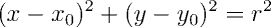

Circulos
--------

Um círculo é o conjunto de pontos equidistantes de um ponto _C_. A distância
de um ponto do círculo ao seu **centro** _C_ é denominada **raio** do círculo.

### Representação de círculos

Conforme sua definição, um círculo pode ser representado através de um ponto
_C_ e um raio _r_.
```C++
// Definição da classe Point

class Circle {
public:
        Point C;
        double r;

        Circle(const Point& Cv = Point(0, 0), double rv = 1.0) : C(Cv), r(rv) {}
};

```

A equação do círculo pode ser deduzida a partir da expressão _d(P, C) = r_,
onde _P = (x, y)_ é um ponto do círculo, _C = (x0, y0)_ é o centro do círculo 
e _r_ é o raio. A equação final é dada a seguir.



Esta equação é útil para resolver vários problemas envolvendo círculos, como
o problema de determinar se um ponto está dentro, fora ou sobre um círculo,
como veremos a seguir.

### Relação entre círculos e pontos

Dado um ponto _P_ e um círculo de centro _C_ e raio _r_, uma (e apenas uma) 
das três afirmações abaixo será verdadeira:

1. _P_ está dentro do círculo;
1. _P_ está sobre o círculo;
1. _P_ está fora do círculo.

Para determinar qual é a relação válida, basta computar a distância entre o
ponto _P_ e o centro _C_ do círculo: caso esta distância seja menor, igual ou
maior que _r_, _P_ estará dentro, sobre e fora do círculo, respectivamente.

```C++
// Definição da classe Point

class Circle {
public:

    // Membros e construtores

    typedef enum { IN, OUT, ON } PointPosition;

    PointPosition position(const Point& P) const
    {
        auto d = P.distance(C);

        return equals(d, r) ? ON : (d < r ? IN : OUT);
    }
};
```

