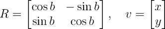

Pontos
------

Os pontos são elementos básicos da geometria, e são elementos adimensionais
(dimensão 0). A maioria dos outros elementos e definições da geometria se
referem a pontos, e o termo ponto, em si, é um termo primitivo (sem definição).

### Representação de pontos

Na prática, em C/C++, um ponto pode ser representado de várias maneiras, cada
uma com suas respectivas vantagens e desvantagens:

1. `struct` ou `class`

    Representar um ponto utilizando uma classe ou estrutura tem a vantagem da
    legibilidade, mas precisa da implementação dos operadores relacionais para
    comparações entre pontos.

    ```C++
typedef struct _Point {
        double x;
        double y;
} Point;

...

Point p, q;     // Declaração
p.x = 5;
q.y = 10;

p = q;          // Atribuição

if (p < q) {    // Erro de compilação: operador < não definido!
        ...
}
    ```

    Nestas representações, é útil definir construtores para a inicialização
    das variáveis.

    ```C++
class Point {
public:
        double x;
        double y;

        Point(double xv = 0, double yv = 0) : x(xv), y(yv) {}
};

...

Point p(5), q(0, 10);     // Exemplos de uso do construtor (p = (5, 0))
    ```


1. `std::pair`

    Usar pares do C++ tem a vantagem de herdar os operadores de comparação dos
    tipos definidos. Porém, a desvantagem é a notação, que utiliza `first` e
    `second` ao invés de `x` e `y`, sendo menos legível que o uso de classes e
    estruturas. Além disso, não podem ser utilizados diretamente para 
    representar pontos tridimensionais.

    ```C++
using point = pair<double, double>;     // C++11

...

point p, q;     // Declaração
p.first = 5;
q.second = 10;

p = q;          // Atribuição

if (p < q) {    // Ok! Operador < para doubles utilizado
        ...
}
    ```

    A desvantagem de notação menos legível pode ser contornada com o uso
    de macros, conforme mostrado abaixo.

    ```C++
#define x first
#define y second
    ```
    Contudo, ao usar tais macros, deve-se tomar cuidado pois todas as aparições 
    de `x` e `y` serão substituídas por `first` e `second`. Logo a declaração de 
    uma variável com nome `x` retorna erro de compilação.

1. _arrays_ 

    Utilizar _arrays_ para representar pontos permite a representação de 
    conjuntos de pontos com facilidade, além de permitir a travessia via 
    laço `for` por coordenada. Porém, peca na legibilidade (índices inteiros
    para acesso aos membros) e na necessidade de definição dos operadores.

    ```C++
double p[2], q[2];      // Declaração usando _arrays_ unidimensionais de tamanho 2
p[0] = 5;
q[1] = 10;

p = q;          // Erro de compilação: operador = não definido!

if (p < q) {    // Perigo: comparação entre os endereços dos ponteiros! O
        ...         // código compila normalmente!
}
    ```

### Comparação entre pontos

Caso a representação para pontos escolhida não herde os comparadores padrão do
C++, é necessário escrever os mesmos para a representação escolhida. Mesmo no
caso do uso de pares, é necessário escrever ao menos o operador de comparação,
para que o mesmo utilize o limiar _e_ (EPS) definido.

Abaixo segue um exemplo de implementação do operador de igualdade:

```C++
#define EPS 10e-9       // Limiar de comparação

using point = pair<double, double>;

bool operator==(const point& a, const point& b)
{
        return fabs(a.first - b.first) < EPS and fabs(a.second - b.second) < EPS;
}
```

A implementação do operador `<` é dada a seguir. Os demais operadores podem ser
implementados de forma semelhante.

```C++
typedef struct _Point {
        double x;
        double y;
} Point;

bool operator<(const Point& p, const Point& q)
{
        return (fabs(p.x - q.x) < EPS) ? (q.y - p.y) > -EPS : q.x - p.x > -EPS);
}

```

Observe que a comparação acima é feita coordenada a coordenada (o uso de pares
herda este tipo de comparação). Em certas situações, pode ser necessário
ordenar pontos por sua distância a origem ou algum outro critério: se for o 
caso, basta alterar a implementação para o critério desejado.

### Distância entre dois pontos

A distância entre dois pontos pode ser utilizado utilizando o Teorema de 
Pitágoras: o quadrado da distância é igual a soma dos quadrados das diferenças
entre as respectivas coordenadas (tanto em duas quanto três dimensões). Se
as coordenadas forem inteiras, pode-se comparar o quadrado diretamente, sem
a extração da raiz quadrada: isto permite a obtenção da igualdade sem o 
recurso do limiar, o que aumenta a velocidade e a precisão do cálculo.

```C++
typedef struct _Point {
        double x;
        double y;
        double z;
} Point;

double distance(const Point& p, const Point& q)
{
    return sqrt((p.x - q.x)*(p.x - q.x) + (p.y - q.y)*(p.y - q.y) + (p.z - q.z)*(p.z - q.z));
}
```

No caso bidimensional, o melhor é utilizar a função `hypot` da biblioteca 
matemática padrão do C/C++: além de computar a distância corretamente, ela
trata de possíveis _underflows_ ou _overflows_ que possam vir a ocorrer
durante o cálculo. 

```C++
using point = pair<double, double>;
point p, q;

...

auto dist = hypot(p.first - q.first, p.second - q.second);  // #include <cmath>
```

### Rotações

Um ponto _P_ pode ser rotacionado _b_ graus radianos em torno da origem (0, 0), 
no sentido anti-horário, através da multiplicação do vetor _v_, cujas 
coordenadas são as mesmas de _P_, pela matriz de rotação _R_, dada abaixo.



Esta matriz pode ser deduzida observando-se que as coordenadas do ponto podem
ser expressas como `x = r cos a, y = r sin a` (onde _a_ é o ângulo que o vetor
posição de _P_ faz com o eixo-_x_ e _r_ é a distância do ponto à origem) e 
que as coordenadas do ponto resultante
 da rotação são `x' = r cos (a + b), y = r sin (a + b)`.

O código abaixo ilustra esta rotação em linguagem C/C++.

```C++
typedef struct _Point {
        double x;
        double y;
} Point;

Point rotate(Point& p, double angle)
{
    auto x = cos(angle) * p.x - sin(angle) * p.y;
    auto y = sin(angle) * p.x + cos(angle) * p.y;

    return Point { x, y };
}
```

O mesmo raciocínio se aplica em três dimensões: as matrizes de rotação 
_Rx, Ry_ e _Rz_, que rotacionam, no sentido anti-horário, em torno dos eixos
_x, y_ e _z_, respectivamente, são dadas abaixo.


### Exercícios

<!--- 152 - Distância entre dois pontos --->
<!--- 587 - Distância entre dois pontos --->
1. UVA
    1. [152 - Tree's a Crowd](https://uva.onlinejudge.org/index.php?option=com_onlinejudge&Itemid=8&category=24&page=show_problem&problem=88)
    2. [587 - There's treasure everywhere!](https://uva.onlinejudge.org/index.php?option=com_onlinejudge&Itemid=8&category=24&page=show_problem&problem=528)

### Referências

HALIM, Steve; HALIM, Felix. [Competitive Programming 3](http://cpbook.net/), Lulu, 2013.
