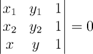
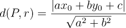
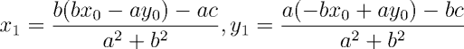

Retas
-----

As retas são elementos unidimensionais da geometria e, assim como a palavra
ponto, reta também é um termo primitivo da geometria.

### Representação de retas

Existem duas representações principais da reta: a equação reduzida e a
equação geral. A equação reduzida de uma reta é a mais conhecida e utilizada
nos cursos de ensino médio, e tem a vantagem de facilitar comparações entre
retas e identificar paralelismo; porém não é capaz de representar retas 
verticais. A equação geral, como o próprio nome diz, pode representar qualquer
reta do plano.

A equação **reduzida** da reta tem a forma _y = mx + b_, onde _m_ é o coeficiente
angular da reta e _b_ é o coeficiente linear da reta. O primeiro coeficiente
representa a variação da reta: consiste no número de unidades que _y_ varia
para cada unidade de variação de _x_ no sentido positivo do eixo horizontal.
O segundo coeficiente é o valor no qual a reta intercepta o eixo _y_.

Baseado na equação reduzida da reta, pode-se representar uma reta, em C/C++,
utilizando-se uma classe ou estrutura da seguinte forma:

```C++
class Line {
public:
        double m;
        double b;

        Line(double mv, double bv) : m(mv), b(bv) {}
};
```

Conforme dito anteriormente, esta representação não permite a representação
de retas verticais. Tal limitação pode ser contornada através do uso de uma
variável booleana, que indica se a reta é ou não vertical. Em caso 
afirmativo, o coeficiente _b_ passa a ser interpretado como o valor no
qual a reta intercepta o eixo _x_.

```C++
class Line {
public:
        double m;
        double b;
        bool vertical;

        Line(double mv, double bv, bool v = false) : m(mv), b(bv), vertical(v) {}
};
```


Dados dois pontos _P = (x1, y1)_ e _Q = (x2, y2)_, com _x1 != x2_, temos
_m = (y2 - y1)/(x2 - x1)_ e pode-se verificar que a reta que passa por 
_P_ e _Q_ tem equação reduzida _y = m(x - x1) + y1_.

```C++
// Definição da classe Point

class Line {
public:
        double m;
        double b;
        bool vertical;

        Line(double mv, double bv, bool v = false) : m(mv), b(bv), vertical(v) {}

        Line(const Point& p, const Point& q)
        {
            if (p.x == q.x)     // Reta vertical
            {
                b = p.x;
                vertical = true;
            } else
            {
                m = (p.y - q.y) / (p.x - q.x);
                b = p.y - p.x * m;
                vertical = false;
            }
        }
};
```

A equação **geral** da reta tem a forma _ax + by + c = 0_ e, como dito, pode
representar retas verticais (onde _b = 0_). Nos demais casos, é possível 
obter a equação reduzida a partir da equação geral. 

```C++
class Line {
public:
        double a;
        double b;
        double c;

        Line(double av, double bv, double cv) : a(av), b(bv), c(cv) {}
};
```

Dados dois pontos _P = (x1, y1)_ e _Q = (x2, y2)_, o coeficiente _c_ pode 
ser obtido pela substituição direta das coordenadas de um dos dois pontos na
equação geral. Conhecido o valor de _c_, pode-se obter os outros dois 
coeficientes resolvendo um sistema linear, cujas equações são resultante das
substituições das coordenadas dos dois pontos.

Contudo, este processo pode ser simplificado com o uso de Álgebra Linear: se
três pontos _P = (x1, y1), Q = (x2, y2)_ e _R = (x, y)_ são colineares 
(isto é, pertencem a uma mesma reta), então o determinante abaixo se anula.



Desta forma, temos _a = y1 - y2, b = x2 - x1, c = x1y2 - x2y1_. Importante
notar que este determinante, além de permitir a identificação dos coeficientes
da equação geral da reta, pode ser utilizado para determinar outras relações,
conforme será explicado mais adiante.

```C++
// Definição da classe Point

class Line {
public:
        double a;
        double b;
        double c;

        Line(double av, double bv, double cv) : a(av), b(bv), c(cv) {}

        Line(const Point& p, const Point& q)
        {
            a = p.y - q.y;
            b = q.x - p.x;
            c = p.x * q.y - p.y * q.x;
        }
};
```

### Retas paralelas, concorrentes, coincidentes e perpendiculares

Em relação às possíveis interseções entre duas retas, há três cenários possíveis:
nenhum ponto em comum, um único ponto em comum ou todos os pontos em comum. No
primeiro caso as retas são ditas **paralelas**; no segundo caso, 
**concorrentes**; no último, **coincidentes**.

O coeficiente angular é a chava para tal classificação: retas com coeficientes
angulares distintos são concorrentes. Na coincidência destes concorrentes, é
necessário verificar também o coeficiente linear: se iguais, as retas são
coincidentes. Retas com coeficientes angulares iguais e coeficientes lineares
distintos são paralelas.

A implementação destas verificações é trivial na representação baseada na
equação reduzida, sendo necessário apenas o cuidado no trato do caso das
retas verticais.

```C++
class Line {
public:
        double m;
        double b;
        bool vertical;

        // Construtores

        bool operator==(const Line& r) const    // Verdadeiro se coincidentes
        {
            if (vertical != r.vertical or m != r.m)
                return false;

            return b == r.b;
        }


        bool parallel(const Line& r) const // Verdadeiro se paralelas
        {
            if (vertical and r.vertical)
                return b != r.b;

            if (vertical or r.vertical)
                return false;

            return (m == r.m) and (b != r.b);
        }
};
```

No caso da representação baseada na equação geral da reta, para checar se retas
são paralelas (ou coincidentes) basta verificar o determinante dos coeficientes
do sistema linear formado por ambas retas: se zero, as retas serão paralelas 
ou coincidentes.

```C++
// Definição de reta baseada na equação geral

#define EPS 1e-9

bool equals(double a, double b)
{
    return fabs(a - b) < EPS;
}

bool parallel(const Line& r, const Line& s)     // Verdadeiro se coincidentes!
{
    return equals(r.a * s.b - r.b * s.a, 0);
}
```

Nesta abordagem, para verificar se as retas são coincidentes, é necessário 
dividir todos os coeficientes da reta por _a_ (ou por _b_, se _a_ for igual a 
zero) e depois comparar os coeficientes de ambas retas: se iguais, as retas
serão coincidentes.

Duas retas serão **perpendiculares** se o produto de seus coeficientes angulares
for igual a -1. Outra maneira de checar se duas retas são perpendiculares é
escolher dois pontos pertencentes a cada reta e montar dois vetores _u_ e _v_
cujas coordenadas são a diferença entre as coordenadas dos pontos escolhidos.
Se o produto interno dos dois vetores for igual a zero, as retas são
perpendiculares.

```C++
// Definição da comparação entre doubles (função equals())

class Line {
public:
        double m;
        double b;
        bool vertical;

        // Construtores

        bool orthogonal(const Line& r) const // Verdadeiro se perpendiculares
        {
            if (vertical and r.vertical)
                return false;

            if ((vertical and r.m == 0) or (m == 0 and r.vertical))
                return true;

            if (vertical or r.vertical)
                return false;

            return equals(m * r.m, -1.0);
        }
};
```


### Interseção entre retas

### Ângulos entre retas

### Distância de um ponto a uma reta

A distância de um ponto _P_ a uma reta _r_ é definida como a menor distância 
possível entre todos os pontos de _r_ e _P_. Contudo, não é necessário computar
estas infinitas distâncias possíveis: a menor distância será aquela entre _P_
e o ponto de interseção _Q_ de _r_ com a reta perpendicular a _r_ que passa por
_P_.

Seja usando álgebra, geometria ou álgebra linear, é possível mostrar que 
esta distância _d_ entre _P = (x0, y0)_ e a reta _ax + by + c = 0_ é dada por



As coordenadas de _Q = (x1, y1)_ podem ser obtidas utilizando-se as expressões 
abaixo



Abaixo temos a implementação da distância e do ponto mais próximo em C++.

```C++
// Definição da classe Point

class Line {
public:
        double a;
        double b;
        double c;

        // Construtores

        double distance(const Point& p) const
        {
            return fabs(a*p.x + b*p.y + c)/hypot(a, b);
        }

        Point closest(const Point& p) const // Ponto da reta mais próximo de p
        {
            auto den = a*a + b*b;
            auto x = (b*(b*to.x - a*to.y) - a*c)/den;
            auto y = (a*(-b*to.x + a*to.y) - b*c)/den;

            return Point(x, y);
        }
};
```

### Distância entre duas retas paralelas

### Referências

HALIM, Steve; HALIM, Felix. [Competitive Programming 3](http://cpbook.net/), Lulu, 2013.

SKIENA, Steven S.; REVILLA, Miguel A. [Programming Challenges: The Programming Contest Training Manual](http://www.programming-challenges.com/), Springer, 2002.

STRANG, Gilbert. [Introdução à Álgebra Linear](http://www.submarino.com.br/produto/116582671/livro-introducao-a-algebra-linear), 4ª edição, LTC, 2013.

Wikipédia. [Distance from a point to a line](https://en.wikipedia.org/wiki/Distance_from_a_point_to_a_line), acesso em 13 de julho de 2016.

