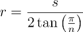
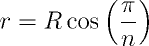

Polígonos
---------

Polígonos são figuras planas delimitadas por caminhos fechados (o vértice de
partida é o vértice de chegada), compostos por segmentos de retas que une
pontos (**vértices**) consecutivos. Os segmentos que unem os vértices são
denominados **arestas**.

A maior parte dos problemas de Geometria Computacional envolvem polígonos.
Embora alguns polígonos especiais (triângulos, quadriláteros) já tenham sido
expostos anteriormente, a abordagem desta seção é mais geral, e pode ser
aplicada a qualquer polígono com qualquer número de vértices.

### Representação de polígonos

A representação mais comum de um polígono é a listagem de seus vértices, sendo
que as arestas ficam subentendidas (há sempre uma aresta unindo dois vértice
consecutivos). Para facilitar a implementação de algumas rotinas, pode ser
conveniente inserir, ao final da lista, o ponto de partida, mas é preciso
tomar cuidado: ao fazer isso, o número de vértices do polígono passa a ser
o número de elementos da lista subtraído de uma unidade.
```C++
// Definição da classe Point

using Polygon = vector<Point>;
```

Esta primeira implementação é a mais compacta possível, mas requer atenção
a questão do número de vértices, conforme já comentado. A implementação abaixo
é mais extensa, porém evita os problemas já mencionados.
```C++
// Definição da classe Point

class Polygon {
public:
    vector<Point> vertices;
    int n;

    // O parâmetro deve conter os n vértices do polígono
    Polygon(const vector<Point>& vs) : vertices(vs), n(vs.size())
    {
        vertices.push_back(vertices[0]);
    }
};
```

Importante notar que ambas implementações não checam a validade do polígono
no que se refere ao número de vértices: um polígono deve ter, no mínimo,
três vértices.

### Perímetro e área

O perímetro de um polígono pode ser calculado diretamente a partir da 
representação
proposta, pois consiste na medida do contorno do polígono, isto é, a soma dos
comprimentos de cada aresta.
```C++
// Definição da classe Point

class Polygon {
public:
    // Membros e construtor

    double perimeter() const
    {
        double p = 0;

        for (int i = 0; i < n; ++i)
            p += vertices[i].distance(vertices[i + 1]);

        return p;
    }
};
```
Já a área de um polígono pode ser também determinada diretamente da
representação dada. Ela corresponde a metade do valor absoluto do
"determinante" abaixo (as
aspas significam que a notação remete a um determinante, mas não é um
determinante de fato, uma vez que a matriz não é quadrada).


```C++
// Definição da classe Point

class Polygon {
public:
    // Membros e construtor

    double area() const
    {
        double a = 0;

        for (int i = 0; i < n; ++i)
        {
            a += vertices[i].x * vertices[i+1].y;
            a -= vertices[i+1].x * vertices[i].y;
        }

        return 0.5 * fabs(a);
    }
};
```

Caso o polígono seja regular (isto é, todos os lados tenham a mesma medida),
a área também pode ser computada através do conhecimento do número de lados
_n_ e um dos três valores abaixo:

1. comprimento de um dos lados (_s_);
1. apótema, ou raio do círculo inscrito (_r_);
1. raio do círculo circunscrito (_R_);


### Polígonos côncavos e convexos

Um polígono é dito **convexo** se, para quaisquer dois pontos _P_ e _Q_
localizados no interior do polígono, o segmento de reta _PQ_ não intercepta
nenhuma das arestas do polígono. Caso contrário, o polígono é dito **côncavo**.

É possível determinar se um polígono é ou não convexo sem recorrer à busca
completa (isto é, testar todos os possíveis pares de pontos interiores ao
polígono):
a rotina de orientação entre pontos e reta (discutida na seção [Retas](Retas.md))
pode ser utilizada para tal fim. Basta checar se, para quaisquer três pontos
consecutivos do polígono, eles tem a mesma orientação (ou sempre a esquerda,
ou sempre à direita).
```C++
// Definição da classe Point

// Implementação da função de orientação D

class Polygon {
public:
    // Membros e construtor

    bool is_convex() const
    {
        vector<Point> vs(vertices);

        if (n < 3)
            return false;

        vs.push_back(vs[1]);    // Temporário/inserção evitam um if no laço

        int orientation = 0, i;

        for (i = 0; i < n; ++i)
        {
            int d = D(vs[i], vs[i + 1], vs[i + 2]);

            if (d == 0)
                continue;

            orientation = d;
            break;
        }

        for (; i < n; ++i)
        {
            int d = D(vs[i], vs[i + 1], vs[i + 2]);

            if (d == -orientation)
                return false;
        }

        return orientation != 0;
    }
};
```

### Relação entre pontos e polígonos

Para se verificar se um ponto _P_ está localizado, ou não, no interior de um
polígono, basta computar a soma dos ângulos formados por _P_ e dois
vértices do polígono (somando-se se o ponto está na mesma orientação do polígono,
subtraíndo em caso contrário): se a soma totalizar _2PI_, o ponto está no
interior do polígono. Esta verificação vale tanto para polígonos convexos
quanto côncavos.
```C++
// Definição da classe Point

// Definição de PI, da função equals() do discriminante D()

// Ângulo APB, em radianos
double angle(const Point& P, const Point& A, const Point& B)
{
    auto ux = P.x - A.x;
    auto uy = P.y - A.y;

    auto vx = P.x - B.x;
    auto vy = P.y - B.y;

    auto num = ux * vx + uy * vy;
    auto den = hypot(ux, uy) * hypot(vx, vy);

    // Caso especial: se den == 0, algum dos vetores é degenerado: os dois
    // pontos são iguais. Neste caso, o ângulo não está definido

    return acos(num / den);
}

class Polygon {
public:
    // Membros e construtores

    bool contains(const Point& P) const
    {
        if (n < 3)
            return false;

        auto sum = 0.0;

        for (int i = 0; i < n; ++i)
        {
            auto d = D(P, vertices[i], vertices[i + 1]);

            // Pontos sobre as arestas ou vértices são considerados interiores
            if (equals(d, 0))
                return true;

            auto a = angle(P, vertices[i], vertices[i + 1]);

            sum += d > 0 ? a : -a;
        }

        return equals(fabs(sum), 2*PI);
    }
};
```

### Relação entre polígonos e retas

Dada uma reta _r_, que passa pelos pontos _A_ e _B_, e um polígono convexo _P_,
com
_n_ vértices, esta reta secciona o polígono em duas regiões, esquerda e direita,
que podem ser ou uma vazias e outra contendo _P_ integralmente, ou serem
compostas de dois polígonos convexos _P1_ e _P2_, resultantes do corte de _P_
por _r_.

A rotina `cut_polygon()`, apresentada abaixo e adaptada de
[Competitive Programming 3](http://cpbook.net/), retorna a região a esquerda
do corte, considerando que _P_ está descrito no sentido anti-horário.
```C++
// Definição da classe Point, da função equals() e do discriminante D()

// Interseção entre a reta AB e o segmento de reta PQ
Point intersection(const Point& P, const Point& Q, const Point& A, const Point& B)
{
    auto a = B.y - A.y;
    auto b = A.x - B.x;
    auto c = B.x * A.y - A.x * B.y;
    auto u = fabs(a * P.x + b * P.y + c);
    auto v = fabs(a * Q.x + b * Q.y + c);

    return Point((P.x * v + Q.x * u)/(u + v), (P.y * v + Q.y * u)/(u + v));
}

Polygon cut_polygon(const Polygon& P, const Point& A, const Point& B)
{
    vector<Point> points;

    for (int i = 0; i < P.n; ++i)
    {
        auto d1 = D(A, B, P.vertices[i]);
        auto d2 = D(A, B, P.vertices[i + 1]);

        // Vértice à esquerda da reta
        if (d1 > -EPS)
            points.push_back(P.vertices[i]);

        // A aresta cruza a reta
        if (d1 * d2 < -EPS)
            points.push_back(intersection(P.vertices[i], P.vertices[i+1], A, B));
    }

    return Polygon(points);
}

```

### Relação entre polígonos e círculos

Um polígono **regular** (isto é, com lados de medidas iguais) de _n_ lados possui
um círculo **circunscrito** (cujos vértices do polígono pertencem ao círculo) e
um círculo **inscrito** (cujos lados são tangentes ao círculo).

O raio _R_ do círculo circunscrito é igual ao raio do polígono: a distância entre
o seu centro e um de seus vértices. A área do polígono pode então ser
computada a partir de _R_ e de _n_, através da expressão dada abaixo.


```C++
// Definição da constante PI

// Área do polígono regular de n lados inscrito no círculo de raio R
double area(double R, int n)
{
    return 0.5*n*R*R*sin(2*PI/n);
}
```

O raio _r_ do círculo inscrito pode ser determinado a partir da medida _s_
de um dos lados do polígono regular, através da relação abaixo,



ou a partir do raio _R_ do círculo circunscrito e _n_, pela relação dada a
seguir.



### Envoltório convexo

Dado um conjunto de pontos _P_, o **envoltório convexo** _CH(P)_ de _P_
(_convex hull_) é o menor polígono convexo tal que cada ponto de _P_ ou
pertence ao interior de _CH(P)_ ou é um de seus vértices.

Existem vários algoritmos para se determinar o envoltório convexo, e como os
vértices de _CH(P)_ são pontos de _P_, a essência dos algoritmos é determinar,
para cada ponto de _P_, se ele pertence ou não ao _CH(P)_.

O algoritmo de Graham iniciamente ordena todos os _n_ pontos de _P_ de acordo
com o ângulo que eles fazem com um ponto pivô fixado previamente. A escolha
padrão para o pivô é o ponto de menor coordenada _y_ e, caso exista mais de
um ponto com coordenada _y_ mínima, escolhe-se o de maior coordenada _x_
dentre eles. Para simplificar o algoritmo, o pivô é movido para a primeira
posição do vetor.
```C++
// Definição da classe Point

Point pivot(vector<Point>& P)
{
    size_t idx = 0;

    for (size_t i = 1; i < P.size(); ++i)
        if (P[i].y < P[idx].y or (equals(P[i].y, P[idx].y) and P[i].x > P[idx].x))
            idx = i;

    swap(P[0], P[idx]);

    return P[0];
}
```

Para realizar a ordenação, é preciso definir um operador booleano que
receba dois pontos _p_ e _q_ e retorne verdadeiro se _p_ antecede _q_ de
acordo com a ordenação proposta. Como é necessário o conhecimento do pivô para
tal ordenação, há três possibilidades para a implementação deste operador:

1. implementar o operator `<` da classe `Point`, tornando o pivô um membro
da classe, para que o operador tenha acesso a ele;
1. tornar o pivô uma variável global;
1. usar uma função lambda no terceiro parâmetro da ordenação, capturando o
pivô por referência ou cópia.

Abaixo segue um código que implementa a terceira estratégia.
```C++
// Definição da classe Point e do discriminante D()

// Definição da função pivot()

void sort_by_angle(vector<Point>& P)
{
    auto P0 = pivot(P);

    sort(P.begin() + 1, P.end(), [&](const Point& A, const Point& B)
        {
            // Corner case: pontos colineares. Escolhe-se o mais próximo do pivô
            if (equals(D(P0, A, B), 0))
                return A.distance(P0) < B.distance(P0);

            auto dx = A.x - P0.x;
            auto dy = A.y - P0.y;
            auto alfa = atan2(dy, dx);

            dx = B.x - P0.x;
            dy = B.y - P0.y;
            auto beta = atan2(dy, dx);

            return alfa < beta;
        }
    );
}
```

Com os pontos ordenados, o algoritmo procede da seguinte forma: ele empilha
três pontos de _P_ (inicialmente, os índices _n -1, 0, 1_) e mantem a invariante
de que os três elementos do topo de pilha estão sempre em sentido anti-horário
(_D() > 0_). Para cada um dos pontos de _P_, verifica-se se este ponto
mantem o sentido anti-horário com os dois elementos do topo da pilha: se sim,
o ponto é inserido na pilha e segue-se adiante; caso contrário, remove-se o
topo da pilha e se verifica o invariante novamente. Como cada ponto é ou inserido ou
removido uma única vez, este processo tem complexidade _O(n)_, e o algoritmo
como um todo tem complexidade _O(nlog n)_, por conta da ordenação.
```C++
// Definição da classe Point e da função sort_by_angle()

Polygon convex_hull(const vector<Point>& points)
{
    vector<Point> P(points);
    auto n = P.size();

    // Corner case: com 3 vértices ou menos, P é o próprio convex hull
    if (n <= 3)
        return Polygon(P);

    sort_by_angle(P);

    vector<Point> s;
    s.push_back(P[n - 1]);
    s.push_back(P[0]);
    s.push_back(P[1]);

    size_t i = 2;

    while (i < n)
    {
        auto j = s.size() - 1;

        if (D(s[j - 1], s[j], P[i]) > 0)
            s.push_back(P[i++]);
        else
            s.pop_back();
    }

    if (s.front() == s.back())
        s.pop_back();

    return Polygon(s);
}
```

Outros algoritmos para o envoltório convexo são o _Andrew's Monotone Chain
Algorithm_ e o algoritmo _Jarvis's March_. Abaixo segue uma implementação
da cadeia monótona. Os pontos devem ser ordenados pela menor coordenada
`x` e, em caso de empate, pela menor coordenada `y`.
```C++
class Point {
public:
    ll x;
    ll y;

    Point(ll xv = 0, ll yv = 0) : x(xv), y(yv) {}

    bool operator<(const Point& P) const
    {
        return x == P.x ? y < P.y : x < P.x;
    }
};

ll D(const Point& P, const Point& Q, const Point& R)
{
    return (P.x * Q.y + P.y * R.x + Q.x * R.y) - (R.x * Q.y + R.y * P.x + Q.x * P.y);
}

vector<Point> monotone_chain_ch(vector<Point>& P)
{
    sort(P.begin(), P.end());

    vector<Point> L, U;

    for (auto p : P)
    {
        while (L.size() >= 2 and D(L[L.size() - 2], L[L.size() -1], p) < 0)
            L.pop_back();

        L.push_back(p);
    }

    reverse(P.begin(), P.end());

    for (auto p : P)
    {
        while (U.size() >= 2 and D(U[U.size() - 2], U[U.size() -1], p) < 0)
            U.pop_back();

        U.push_back(p);
    }

    L.pop_back();
    U.pop_back();

    L.reserve(L.size() + U.size());
    L.insert(L.end(), U.begin(), U.end()); 

    return L;
}


```

### Exercícios

<!--- 1C - Área do polígono regular inscrito --->
<!--- 218 - Convex hull, impressão, perímetro -->
<!--- 478 - Verificação de pontos no interior de círculos e polígonos -->
<!--- 681 - Convex hull -->
<!--- 1111 - Convex hull, distância entre ponto e reta -->
<!--- 10432 - Área do polígono regular inscrito -->
<!--- 10451 - Área do círculos inscritos e circunscritos -->
<!--- 10652 - Convex hull, rotações, área de polígonos -->
<!--- 11265 - Corte de polígonos por retas, área de polígonos -->
<!--- 11626 - Monotone Chain Convex hull -->
1. Codeforces
    1. [1C - Ancient Berland Circus](http://codeforces.com/problemset/problem/1/C)
1. UVA
    1. [218 - Moth Eradication](https://uva.onlinejudge.org/index.php?option=com_onlinejudge&Itemid=8&page=show_problem&category=24&problem=154&mosmsg=Submission+received+with+ID+18082611)
    1. [478 - Points in Figures: Rectangles, Circles, Triangles](https://uva.onlinejudge.org/index.php?option=com_onlinejudge&Itemid=8&category=16&page=show_problem&problem=419)
    1. [681 - Convex Hull Finding](https://uva.onlinejudge.org/index.php?option=com_onlinejudge&Itemid=8&page=show_problem&category=24&problem=622&mosmsg=Submission+received+with+ID+18073756)
    1. [1111 - Trash Removal](https://uva.onlinejudge.org/index.php?option=com_onlinejudge&Itemid=8&category=24&page=show_problem&problem=3552)
    1. [10432 - Polygon Inside A Circle](https://uva.onlinejudge.org/index.php?option=com_onlinejudge&Itemid=8&page=show_problem&category=24&problem=1373&mosmsg=Submission+received+with+ID+17856547)
    1. [10451 - Ancient Village Sports](https://uva.onlinejudge.org/index.php?option=com_onlinejudge&Itemid=8&category=24&page=show_problem&problem=1392)
    1. [10652 - Board Wrapping](https://uva.onlinejudge.org/index.php?option=com_onlinejudge&Itemid=8&page=show_problem&category=763&problem=1593&mosmsg=Submission+received+with+ID+17845295)
    1. [11265 - The Sultan's Problem](https://uva.onlinejudge.org/index.php?option=com_onlinejudge&Itemid=8&page=show_problem&category=24&problem=2232&mosmsg=Submission+received+with+ID+17859560)
    1. [11626 - Convex Hull](https://uva.onlinejudge.org/index.php?option=com_onlinejudge&Itemid=8&page=show_problem&category=24&problem=2673&mosmsg=Submission+received+with+ID+18086820)

### Referências

HALIM, Steve; HALIM, Felix. [Competitive Programming 3](http://cpbook.net/), Lulu, 2013.

Math Open Reference. [Incircle of a Polygon](http://www.mathopenref.com/polygonincircle.html). Acesso em 18/08/2016.

Mathwords. [Area of a Regular Polygon](http://www.mathwords.com/a/area_regular_polygon.htm). Acesso em 20/09/2016.

Wikipédia. [Regular Polygon](https://en.wikipedia.org/wiki/Regular_polygon#Circumradius). Acesso em 18/08/2016.
