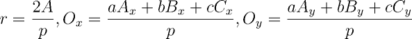

Triângulos
----------

Os triângulos são polígonos com três vértices e três arestas. É o mais
simples dos polígonos, mas guarda uma série de propriedades e características
notáveis.

### Representação de triângulos

Um triângulo pode ser representado ou pelas coordenadas de seus vértices ou
pela medida de seus três lados. A segunda representação pode ser deduzida
a partir da primeira, mas no sentido oposto haveriam infinitas possibilidades.

```C++
// Definição da classe Ponto

class Triangle {
public:
    Point A, B, C;

    Triangle(const Point& P, const Point& Q, const Point& R) : A(P), B(Q), C(R) {}
}
```

A representação através dos vértices pode levar a um caso especial: se os
três pontos estiverem alinhados, o triângulo se degenera em um segmento de reta.

```C++
// Definição da classe Ponto

class Triangle {
public:
    double a, b, c;

    Triangle(double av, double bv, double cv) : a(av), b(bv), c(cv) {}
}
```

Já na representação pelas medidas dos três lados, o número de casos especiais
aumenta: além do caso degenerado (quanto a soma de dois lados coincide com o
terceiro), há o perigo das medidas não formarem um triângulo de fato: a
**Desigualdade Triangular** garante que, dadas as medidas _a, b, c_ dos lados
do triângulo, a soma de duas destas medidas é sempre maior do que a medida
restante.

### Classificação de triângulos

Os triângulos podem ser classificados pela medida de seus lados ou de seus
ângulos internos.

Sejam _a, b, c_ as medidas dos três lados de um triângulo. O triângulo é dito
**equilátero** se _a = b = c_; **isósceles** se dois lados são iguais; 
ou **escaleno** se todos os três valores forem
distintos.
```C++
class Triangle {
public:
    // Membros e construtor

    typedef enum { EQUILATERAL, ISOSCELES, SCALENE } Sides;

    Sides classification_by_sides() const
    {
        if (a == b and b == c)
            return EQUILATERAL;

        if (a == b or a == c or b == c)
            return ISOSCELES;

        return SCALENE;
    }
}
```

Sejam _BC, AC, AB_ os ângulos opostos aos lados _a, b, c_ de um triângulo.
O triângulo é dito **retângulo** se um dos três ângulo é igual a 90º;
**obtusângulo** se um dos três ângulo é maior que 90º; ou **acutângulo** se
todos os três ângulos forem menores que 90º (lembrando que
_AB + AC + BC = 180º_).

É possível determinar os ângulos internos de um triângulo através da
**Lei dos Cossenos**, enunciada abaixo.


```C++
class Triangle {
public:
    // Membros e construtor

    typedef enum { RIGHT, ACUTE, OBTUSE } Angles;

    Angles classification_by_angles() const
    {
        auto AB = acos((c*c - a*a - b*b)/(-2*a*b));
        auto AC = acos((b*b - a*a - c*c)/(-2*a*c));
        auto BC = acos((a*a - b*b - c*c)/(-2*b*c));

        auto right = PI / 2.0;

        if (equals(AB, right) || equals(AC, right) || equals(BC, right))
            return RIGHT;

        if (AB > right || AC > right || BC > right)
            return OBTUSE;

        return ACUTE;
    }
}
```

Se for necessário verificar apenas se o triângulo é retângulo ou não, basta
utilizar o **Teorema de Pitágoras**: o quadrado da hipotenusa (maior lado) é
igual a soma dos quadrados dos outros lados (catetos). O Teorema de Pitágoras
pode ser deduzido da Lei dos Cossenos fazendo _c_ igual a hipotenusa e
_AB = 90º_.

### Perímetro e área

O perímetro de um triângulo é igual a soma das medidas dos seus lados.
```C++
class Triangle {
public:
    // Membros e construtor

    double perimeter() const
    {
        return a + b + c;
    }
}
```

A área delimitada pelo triângulo pode ser determinada de três maneiras.
A primeira delas é computar a metade do produto entre a **base** (o comprimento
de um dos lados do triângulo) e a **altura** (segmento de reta, perpendicular
 à base,
com um ponto sobre a base e o outro no vértice oposto a esta). Contudo,
na representação por pontos ou pelas medidas, esta abordagem é pouco prática,
pois envolve o cálculo da altura.

A segunda maneira é utilizar a **Fórmula de Heron**, dada abaixo,
onde _A_ é a área do triângulo de lados _a, b, c_ e _s_ é o semiperímetro
(metade do perímetro). Esta abordagem é a mais
apropriada na representação do triângulo pela medida de seus lados.


```C++
class Triangle {
public:
    // Membros e construtor

    // Perímetro

    double area() const
    {
        auto s = perimeter() / 2.0;

        return sqrt(s*(s - a)*(s - b)*(s - c));
    }
}
```

Observe que, caso exista a possibilidade de _overflow_ no produto dos quatro
termos que estão dentro da raiz, deve-se tirar a raiz de cada fator antes de
fazer o produto.

Existem variantes da fórmula de Heron que permitem o cálculo da área do 
triângulo em termos de outras medidas, como as medianas, as alturas ou os
ângulos internos. Se _ma, mb, mc_ são as medidas das medianas, então


Se _ha, hb, hc_ são medidas as alturas, então


Por fim, sendo usando a notação de lados e ângulos já estabelecida, é possível
computar a área, conhecidos os três ângulos e apenas um dos três lados:


A terceira maneira é computar a área a partir das coordenadas dos vértices.
Se os vértices de um triângulo são _P = (x1, y1), Q = (x2, y2), R = (x3, y3)_,
a área _A_ do triângulo é dada pela metade do módulo do determinante mostrado
abaixo.


Naturalmente, esta é a melhor abordagem para a representação do triângulo pelas
coordenadas de seus vértices.
```C++
class Triangle {
public:
    // Membros e construtor

    double area() const
    {
        double det = (A.x*B.y + A.y*C.x + B.x*C.y) - (C.x*B.y + C.y*A.x + B.x*A.y);

        return 0.5 * fabs(det);
    }
}
```

### Lugares geométricos

Um triângulo possui quatro lugares geométricos notáveis. O primeiro deles é o
**baricentro** (centroide ou centro de massa), que é o ponto de interseção entre
as três **medianas** (segmentos de reta que unem um vértice ao ponto médio do
lado oposto). O baricentro divide uma mediana na proporção de 2:1, isto é,
ele está a um terço de distância do lado oposto.

As coordenadas do baricentro podem ser computadas diretamente a partir das
coordenadas dos vértices: serão a média aritmética entre as mesmas.
```C++
// Definição da classe Ponto

class Triangle {
public:
    // Membros e construtor

    Point barycenter() const
    {
        auto x = (A.x + B.x + C.x) / 3.0;
        auto y = (A.y + B.y + C.y) / 3.0;

        return Point(x, y);
    }
};
```

O **ortocentro** de um triângulo é o ponto de encontro de suas três alturas. O
ortocentro pode mesmo estar fora do triângulo (no caso de um obtusângulo). No caso de um triângulo retângulo, o ortocentro sempre coincide com o vértice oposto à hipotenusa.

O **incentro** de um triângulo é o ponto de encontro de suas bissetrizes
(retas que dividem um ângulo interno na metade). Além de ser sempre um ponto
interior do triângulo, o incentro é o centro do círculo **inscrito** no
triângulo, isto é, o maior círculo que cabe dentro do triângulo e que toca todos
os seus três lados (os lados são tangentes ao círculo inscrito).

O raio do círculo inscrito é dado pela razão entre o dobro da área e o
perímetro. As coordenadas do centro _O_ do círculo inscrito são obtidas pela
média ponderada das coordenadas _x_ e _y_ pelos comprimentos dos lados
opostos. As fórmulas abaixo sintetizam estas afirmações.



```C++
// Definição da classe Ponto

class Triangle {
public:
    // Membros e construtor

    // Área e perímetro

    // Raio do círculo inscrito
    double inradius() const
    {
        return (2 * area()) / perimeter();
    }

    // Centro do círculo inscrito
    Point incenter() const
    {
        auto p = perimeter();
        auto x = (a*A.x + b*B.x + c*C.x)/p;
        auto y = (a*A.y + b*B.y + c*C.y)/p;

        return Point(x, y);
    }

```

O **circuncentro** é o ponto de encontro entre as retas bisectoras perpendiculares
(isto é, retas perpendiculares aos lados do triângulo que os interceptam nos
pontos médios). O circuncentro é o centro do círculo circunscrito do triângulo,
isto é, o círculo que passa pelos três vértices do triângulo.

O circuncentro, assim como o ortocentro, pode estar localizado do lado externo
do triângulo. Um caso especial interessante é o do triângulo retângulo, onde o
circuncentro se localiza no ponto médio da hipotenusa.

O raio do circuncentro é dado pela razão entre o produto das medidas de seus
lados e o quádruplo de sua área. As coordenadas do circuncentro podem ser
determinadas pelas expressões abaixo, onde _|A|² = Ax² + Ay²_.


```C++
// Definição da classe Ponto

class Triangle {
public:
    // Membros e construtor

    // Área e perímetro

    // Raio do círculo circunscrito
    double circumradius() const
    {
        return (a * b * c)/(4 * area());
    }

    // Centro do círculo circunscrito
    Point circumcenter() const
    {
        auto D = 2*(A.x*(B.y - C.y) + B.x*(C.y - A.y) + C.x*(A.y - B.y));

        auto A2 = A.x*A.x + A.y*A.y;
        auto B2 = B.x*B.x + B.y*B.y;
        auto C2 = C.x*C.x + C.y*C.y;

        auto x = (A2*(B.y - C.y) + B2*(C.y - A.y) + C2*(A.y - B.y))/D;
        auto y = (A2*(C.x - B.x) + B2*(A.x - C.x) + C2*(B.x - A.x))/D;

        return Point(x, y);
    }
```

A **reta de Euler** é uma reta especial associada ao triângulo, que passa
pelo baricentro, ortocentro e circuncentro, que estão sempre alinhados.

### Lei dos senos

A **Lei dos Senos** estipula uma relação entre os ângulos internos de um
triângulo e seus lados opostos. Se _A, B, C_ são os ângulos internos opostos aos
lados _a, b, c_, e _R_ é o raio do círculo circunscrito, então a razão entre
o lado e o seno do ângulo oposto é igual a 2 vezes o raio _R_.


```C++
// Definição da classe Ponto

class Triangle {
public:
    // Membros e construtor

    // Raio do círculo circunscrito
    double opposite_angle(double side) const
    {
        auto R = circumradius();

        return asin(side/(2*R));
    }
};
```

### Exercícios

<!--- 143 - Relação ponto/triângulo, colisão ponto/triângulo -->
<!--- 375 - Perímetro do círculo inscrito, semelhança de triângulos -->
<!--- 10195 - Raio do círculo inscrito -->
<!--- 10557 - Círculo circunscrito -->
<!--- 10991 - Lei dos cossenos, arcos -->
<!--- 11281 - Raio do círculo circunscrito, Lei dos cossenos, fit triângulo em círculo -->
<!--- 11152 - Raios dos círculos inscritos e circunscritos -->
<!--- 11479 - Classificação de triângulos, desigualdade triangular -->
<!--- 11854 - Teorema de Pitágoras -->
<!--- 11909 - Triângulos semelhantes, área de triângulos, área de retângulos -->
1. UVA
    1. [143 - Orchard Trees](https://uva.onlinejudge.org/index.php?option=com_onlinejudge&Itemid=8&page=show_problem&category=24&problem=79&mosmsg=Submission+received+with+ID+17934611)
    1. [375 - Inscribed Circles and Isosceles Triangles](https://uva.onlinejudge.org/index.php?option=com_onlinejudge&Itemid=8&page=show_problem&category=24&problem=311&mosmsg=Submission+received+with+ID+17930986)
    1. [10195 - The Knights of the Round Table](https://uva.onlinejudge.org/index.php?option=com_onlinejudge&Itemid=8&page=show_problem&category=24&problem=1136&mosmsg=Submission+received+with+ID+17929614)
    1. [10577 - Bouding Box](https://uva.onlinejudge.org/index.php?option=com_onlinejudge&Itemid=8&category=24&page=show_problem&problem=1518)
    1. [10991 - Region](https://uva.onlinejudge.org/index.php?option=com_onlinejudge&Itemid=8&page=show_problem&category=24&problem=1932&mosmsg=Submission+received+with+ID+17971846)
    1. [11281 - Triangular Pegs in Round Holes](https://uva.onlinejudge.org/index.php?option=com_onlinejudge&Itemid=8&page=show_problem&category=24&problem=2256&mosmsg=Submission+received+with+ID+18002754)
    1. [11152 - Colourful Flowers](https://uva.onlinejudge.org/index.php?option=com_onlinejudge&Itemid=8&category=24&page=show_problem&problem=2093)
    1. [11479 - Is this the easiest problem?](https://uva.onlinejudge.org/index.php?option=com_onlinejudge&Itemid=8&page=show_problem&category=24&problem=2474&mosmsg=Submission+received+with+ID+17966551)
    1. [11854 - Egypt](https://uva.onlinejudge.org/index.php?option=com_onlinejudge&Itemid=8&page=show_problem&category=24&problem=2954&mosmsg=Submission+received+with+ID+17881809)
    1. [11909 - Soya Milk](https://uva.onlinejudge.org/index.php?option=com_onlinejudge&Itemid=8&category=24&page=show_problem&problem=3060)

### Referências

HALIM, Steve; HALIM, Felix. [Competitive Programming 3](http://cpbook.net/), Lulu, 2013.

Math Open Reference. [Orthocenter of a Triangle](http://www.mathopenref.com/triangleorthocenter.html). Acesso em 27/07/2016.

Math Open Reference. [Incenter of a Triangle](http://www.mathopenref.com/coordincenter.html). Acesso em 22/08/2016.

Wikipedia. [Circumscribed Circle](https://en.wikipedia.org/wiki/Circumscribed_circle#Circumcircle_equations). Acesso em 27/07/2016.

Wikipedia. [Heron's formula](https://en.wikipedia.org/wiki/Heron%27s_formula). Acesso em 22/09/2016.
