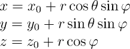
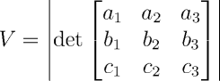
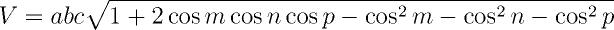

Objetos Tridimensionais
-----------------------

Embora sejam menos comuns do que os objetos bidimensionais em competições, os
primitivos geométricos tridimensionais podem aparecer em problemas, tanto
como ponto central da questão ou como uma etapa intermediária para atingir 
a solução desejada.

Abaixo são apresentadas as principais características de alguns elementos
geométricos primitivos.

### Esfera

A esfera é o conjunto de pontos do espaço tridimensional que são equidistantes
de um ponto fixo. Este ponto fixo é denominado **centro** _C_ da esfera, e a
distância de um ponto da esfera a _C_ é denominada **raio** _r_.

A esfera por ser representa, em coordenadas cartesianas, pela equação abaixo,
onde (_x0, y0_) são as coordenadas do centro e _r_ é o raio.


Pode ser útil, porém, utilizar a representação da esfera em coordenadas
esféricas, onde _r_ é o raio, _theta_ um ângulo que varia de 0 a 2PI e 
_phi_ é um ângulo que varia de 0 a PI, conforme apresentado abaixo.



A área da superfície da esfera é dada por `A = 4*PI*r^2`, e o seu volume é
igual a `V = (4/3)*PI*r^3`, o que pode ser verificado através das integrais de
área e volume das coordenadas esféricas, cujo jacobiano é dado por 
`r²sin(phi)`.

```C++
// Definição da classe Point3D

// Definição da constante PI

class Sphere {
public:
    Point3D C;
    double r;

    Sphere(const Point3D& C, double rv) : C(Cv), r(rv) {}

    double area() const
    {
        return 4.0*PI*r*r;
    }

    double volume() const
    {
        return 4.0*PI*r*r*r/3.0;
    }
};
```


### Cubo

Um cubo é uma região do espaço delimitada por 6 quadrados idênticos, unidos
por meio de suas arestas. O cubo é um dos cinco polígonos regulares (os demais
são o tetraedro, o octaedro, o dodecaedro e o icosaedro), que também são
denominados Sólidos de Platão. Ele possui 12 arestas, 6 faces e 8 vértices
(o que pode ser confirmado pela Equação de Euler: V + F - A = 2).

A menos de sua posição no espaço, um cubo pode ser unicamente determinado pela
medida `L` do lado do quadrado que compõe suas faces. A medida da diagonal facial
(isto é, a diagonal que une dos vértices opostos de uma mesma face) é igual
a `L * sqrt(2)`.
A medida da diagonal espacial (isto é, a diagonal que une dois vértices opostos,
atravessando o cubo por seu interior) é dada por `L * sqrt(3)`.
```C++
class Cube {
public:
    double L;

    Cube(double Lv) : L(Lv) {}

    double face_diagonal() const
    {
        return L*sqrt(2.0);
    }

    double space_diagonal() const
    {
        return L*sqrt(3.0);
    }
};
```

A área da superfície do cubo (a soma das áreas de suas faces) é igual a
`6L^2`. Já o volume é dado por `L^3`. Sendo uma expressão cúbica, é preciso
tomar cuidado com possíveis _overflows_.
```C++
class Cube {
public:
    // Membros e construtor

    double area() const
    {
        return 6.0*L*L;
    }

    double volume() const
    {
        return L*L*L;
    }
};
```

O cubo tem três esferas associadas:

1. a esfera **circunscrita**, que passa pelos 8 vértices, com raio `L*sqrt(3)/2`;
1. a esfera **inscrita**, tangente às 6 faces, com raio `L/2`;
1. a esfera **tangente** às arestas, com raio `L/sqrt(2)`.

### Paralelepípedo

Um paralelepípedo é uma figura geométrica formada por seis paralelogramos. Em
geral, um paralelogramo é representado por três vetores linearmente 
independentes `A, B, C` (caso sejam dependentes, temos um paralelepípedo 
degenerado, cujo volume é zero).

Enquanto sua área pode ser determinada pelas somas das áreas de suas faces,
o volume pode ser determinado através do módulo do produto misto 
`V = |<A x B, C>|`, onde
`<x, y>` é o produto interno entre os vetores `x` e `y`. Na prática, este
produto misto é equivalente ao determinante abaixo.



Se conhecidos apenas os comprimentos `a, b, c` das arestas e os ângulos internos
`m, n, p` formados entre elas, é possível computar o volume do paralelogramo
através da expressão abaixo.



```C++
// Definição da classe Vector3D

class Parallelepiped {
public:
    Vector3D A, B, C;

    Parallelepiped(const Vector3D& Av, const Vector3D& Bv, const Vector3D& Cv) :
        A(Av), B(Bv), C(Cv) {}

    double volume() const
    {
        return fabs(A.x*B.y*C.z + A.y*B.z*C.x + A.z*B.x*C.y - A.x*B.z*.Cy 
            - A.y*B.x*C.z - A.z*B.y*C.x);
    }

    // Implementação alternativa do método volume()
    double volume2() const
    {
        double a = A.lenght();
        double b = B.length();
        double c = C.length();

        double m = angle(A, B);
        double n = angle(A, C);
        double p = angle(B, C);

        return a*b*c*sqrt(1 + 2*cos(m)*cos(n)*cos(p) - cos(m)*cos(m)
            - cos(n)*cos(n) - cos(p)*cos(p);
    }
    
    // Outra implementação possível
    double volume2() const
    double volume3() const
    {
        return fabs(dot_product(A, cross_product(B, C)));
    }

    double area() const
    {
        double AB = cross_product(A, B).length();
        double AC = cross_product(A, C).length();
        double BC = cross_product(B, C).length();

        return 2*(AB + AC + BC);
    }
};
```

### Cilindro

O cilindro é uma figura geométrica formada pelos pontos equidistantes de um
eixo (segmento de reta) dado. Esta distância fixa recebe o nome de raio _r_.
Em geral, um cilindro é representado pelo raio e pela distância entre as duas
faces circulares opostas, denominada altura _h_.

A área lateral do cilindro é dada por `A = 2*PI*r*h + 2*PI*r*r = 2*PI*r*(h + r)`,
isto é, sua área lateral (um retângulo de base `2*PI*r`, que é a circunferência
do círculo e altura `h`) e o dobro da área da base (`PI*r*r`).

O volume, por sua vez, pode ser computado de duas formas: ou por uma integral de
área, usando coordenadas cilíndricas (`x = r\cos theta, y = r\sin theta, z = z`,
onde `0 <= theta <= 2*PI`) ou como uma superfície de revolução em torno do 
eixo central. Em ambos casos obtemos `V = PI*r*r*h`, que é igual a área da base
vezes a altura.

```C++
// Definição da constante PI

class Cylinder {
public:
    double r, h;

    Cylinder(double rv, double hv) : r(rv), h(hv) {}

    double area() const
    {
        return 2*PI*r*(r + h);
    }

    double volume() const
    {
        return PI*r*r*h;
    }
};
```

<!--- inserir texto sobre interseção de cilindros e planos -->

### Cone

Um cone é uma figura geométrica formada pela união de todas as retas (ou
segmentos de retas) que unem uma base plana (uma região fechada) a um ponto
externo ao plano da base, denominado vértice ou _apex_.

O mais comum dentre os cones é o **cone circular reto**, onde a base é um
círculo e o vértice está localizado na reta perpendicular ao plano onde se
encontra o círculo e que passa pelo centro do mesmo. Tal cone pode ser 
determinado pelo círculo da base (centro e raio) e pela distância do vértice
ao plano, denominada _H_. Se a localização exata do cone não for necessária,
bastam apenas a distância _H_ e o raio _r_ do círculo.

O volume do cone circular reto pode ser computado através da integral de
revolução em torno do eixo-x, com `0 <= x <= H` e `f(x) = rx/H`, o que 
resulta em `V = PI*r*r*H/3`.

Já a área da superfície do cone é a soma da área da base (`PI*r*r`) mais 
a área lateral (`PI*r*sqrt(r*r + H*H)`). O valor `L = sqrt(r*r + H*H)` surge do
triângulo retângulo formado pelo vértice, pelo centro e por um ponto do círculo.
Se o cone for cortado num segmento de reta que une o círculo ao vértice e 
aberto, ele resultará em uma fração do círculo de raio `L`, cujo arco é 
`2*PI*r`, o que resulta em uma área lateral de `PI*R*L`.

O tronco de um cone, que é obtido através da seção de um cone por um plano
paralelo à base. Se `R` é o raio da base do cone, `r` o raio do círculo 
resultante da seção, e `h` a altura do tronco, o volume do tronco é dado por
`V = PI*h*(R*R + R*r + r*r)/3`, sendo obtido pela diferença do volume do cone
maior pelo cone menor.

```C++
class Cone {
public:
    double r, H;

    Cone(double rv, double Hv) : r(rv), H(Hv) {}

    double volume() const
    {
        return PI*r*r*H/3.0;
    }

    double area() const
    {
        return PI*r*r + PI*r*sqrt(r*r + H*H);
    }

    double frustum(double rm, double h) const
    {
        return PI*h*(r*r + r*rm + rm*rm)/3.0;
    }
};
```

### Exercícios

<!--- 737 - Interseção de cubos -->
<!--- 815 - Volume de paralelepípedos -->
<!--- 10297 - Volume de cones, cilindros e frustum -->
1. UVA
    1. [737 - Gleaming the Cubes](https://uva.onlinejudge.org/index.php?option=com_onlinejudge&Itemid=8&page=show_problem&category=24&problem=678&mosmsg=Submission+received+with+ID+17776075)
    1. [815 - Flooded!](https://uva.onlinejudge.org/index.php?option=com_onlinejudge&Itemid=8&page=show_problem&category=24&problem=756&mosmsg=Submission+received+with+ID+17791949)
    1. [10297 - Beavergnaw](https://uva.onlinejudge.org/index.php?option=com_onlinejudge&Itemid=8&page=show_problem&category=24&problem=1238&mosmsg=Submission+received+with+ID+17771134)

### Referências

HALIM, Steve; HALIM, Felix. [Competitive Programming 3](http://cpbook.net/), Lulu, 2013.

The University of Georgia. [Volume of a Frustum of a Right Circular Cone](http://jwilson.coe.uga.edu/emt725/Frustum/Frustum.cone.html). Acesso em 03/08/2016.

Wikipedia. [Cylinder (geometry)](https://en.wikipedia.org/wiki/Cylinder_(geometry))

Wkipedia. [Parallelepiped](https://en.wikipedia.org/wiki/Parallelepiped)
