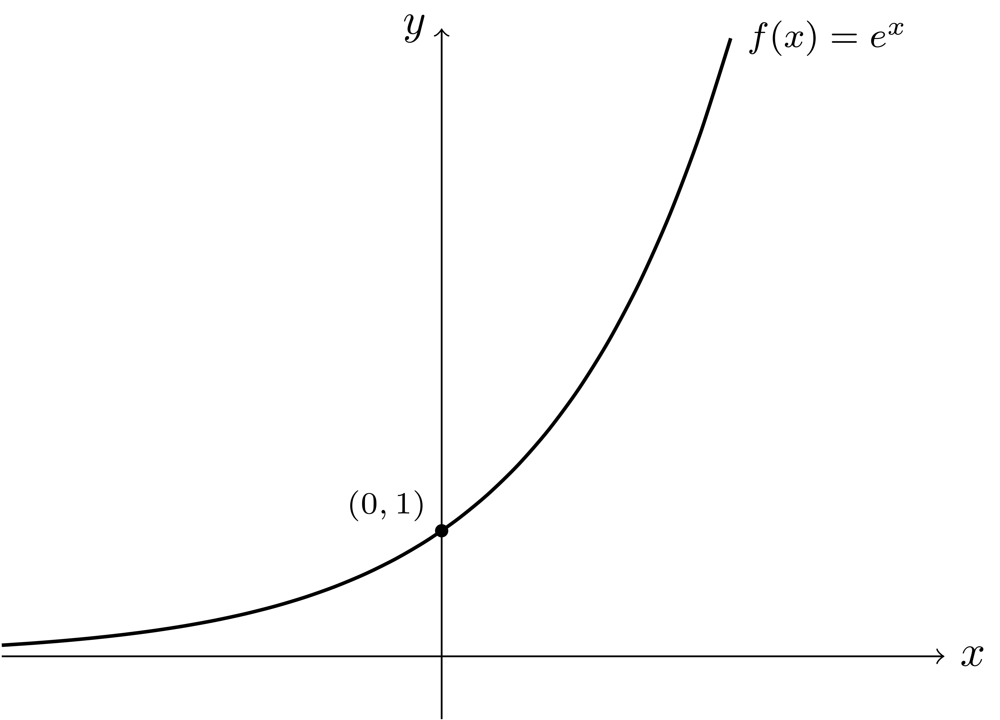
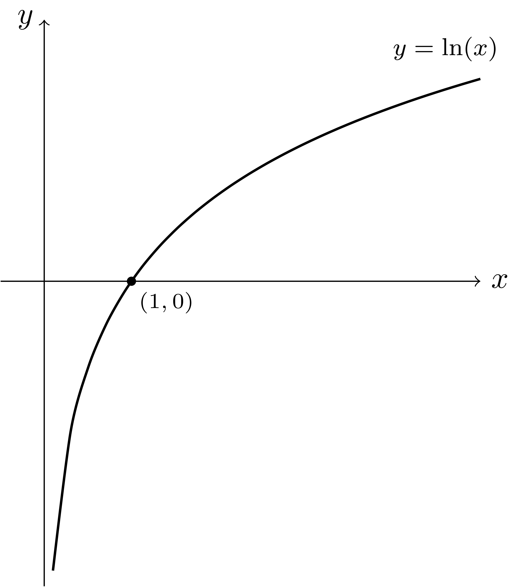

<!-- _class: lead -->
# Matemática

*__Função exponencial e função logaritmo__*

Prof. Edson Alves
Faculdade UnB Gama

## Número de Euler

O número de Euler é a constante $e$, dada por
$$
    e = \lim_{n\to \infty} \left(1 + \frac{1}{n}\right)^n = 2,71828\ldots
$$

Este limite corresponde a uma taxa de juros com capitalização instantânea.

## Função exponencial

A função exponencial $\exp(x)$ é definida, para qualquer $x$ real, por
$$
    \exp(x) = \lim_{n\to \infty} \left(1 + \frac{x}{n}\right)^n = e^x
$$

Observe que imagem de $\exp(x)$ é o conjunto dos números reais positivos.

## Gráfico da função exponencial

## Função logaritmo

A função logaritmo $\ln(x)$ é definida, para qualquer $x$ real positivo, por
$$
    \ln(x) = \log_e(x) = \int_1^x \frac{1}{t}dt
$$

Observe que, se $0 < x < 1$, então $\ln x < 0$, por conta da inversão dos limites de integração.

## Gráfico da função logaritmo

## Relação entre as funções exponencial e logaritmo

- Embora sejam definidas em contextos distintos (limite no caso da exponencial, integral no caso do logaritmo), ambas funções estão profundamente relacionadas

- De fato, ambas são mutuamente inversas, isto é, $\ln e^x = x$ e $e^{\ln x} = x$

- Esta relação permite manipular expressões envolvendo expoentes, por meio das propriedades das exponenciais e dos logaritmos

## Aplicação: Derivada da função exponencial

- Considere a seguinte equação diferencial: $y'(x) = y(x)$, com $y(0) = 1$

- Uma solução desta equação é uma função que coincide com sua derivada

- Esta equação pode ser reescrita como
$$
    \frac{y'(x)}{y(x)} = 1
$$

- Integrando em ambos lados segue que
$$
    \ln y(x) = x + C
$$

## Aplicação: Derivada da função exponencial

- Aplicando a exponencial em ambos lados obtém-se
$$
    y(x) = e^{\ln y(x)} = e^{x + C} = e^Ce^x
$$

- Do fato que $y(0) = 1$ segue que $e^C = 1$ e, portanto, que $y(x) = e^x$

- Ou seja, a derivada da função exponencial é a própria exponencial

- Uma consequência imediata deste fato é que
$$
\int e^u du = e^u + C
$$

## Aplicação: Primeiros dígitos de uma exponenciação

- É possível determinar os primeiros dígitos do resultado de uma exponencial da forma $a^k$ em uma base $b$ dada, com $a > 0$ e $b > 1$

- Observe que 
$$
    a^k = b^{\log_b a^k} = b^{k\log_b a}
$$

- Seja $r = \lfloor k\log_b a\rfloor$ e $s = k(\log_b a) - r$. Daí
$$
a^k = b^{k\log_b a} = b^{r + s}
$$

## Aplicação: Primeiros dígitos de uma exponenciação

- Como $r$ é inteiro positivo, $b^r$ adiciona $r$ zeros ao final da representação de $a^k$ em base $b$

- Assim, os dígitos não-nulos de $a^k$ provém de $a^s$

- Por exemplo, $2^{80} = 1208925819614629174706176$ e $80\log_{10} 2 = 24.082399653118497$

- Daí, $s = 0.082399653118497$ e 
$$
    10^{0.082399653118497} = 1.2089258196146322
$$

## Aplicação: Meia-vida

- A meia-vida é o tempo necessário para desintegrar metade da massa de um radioisótopo

- Se a massa inicial é $M_0$ e o decaimento é exponencial, a massa no instante $t$ é dada por
$$
    M(t) = M_0e^{kt},
$$
onde $k$ é uma constante que depende do material

- Assim, a meia-vida seria o instante $t_{1/2}$ tal que
$$
    M(t_{1/2}) = \frac{M_0}{2} = M_0e^{kt_{1/2}}
$$

## Aplicação: Meia-vida

- Aplicando o logaritmo em ambas expressões obtém-se
$$
    \ln M_0 - \ln 2 = \ln M_0 + kt_{1/2}
$$

- Assim,
$$
    t_{1/2} = - \frac{\ln 2}{k}
$$

- Veja que esta expressão permite computar a constante $k$ se a meia-vida for conhecida

## Série da função exponencial

A função exponencial pode ser expandida na série de potências
$$
    e^x = \sum_{i = 0}^\infty \frac{x^i}{i!} = 1 + x + \frac{x^2}{2!} + \frac{x^3}{3!} + \ldots
$$

Esta série converge para qualquer $x$ real.

## Série da função logaritmo

A função logaritmo deslocada pode ser expandida na série de potências
$$
    \ln (x + 1) = \sum_{i = 1}^\infty (-1)^{i - 1}\frac{x^i}{i} = x - \frac{x^2}{2} + \frac{x^3}{3} - \frac{x^4}{4} + \ldots
$$

Esta série converge apenas no intervalo $-1 < x < 1$.

## Exponenciais complexas

Por meio da manipulação das séries de potência de $e^x, \cos x$ e $\sin x$ é possível mostrar que, para um número complexo $a + bi$, que
$$
e^{a + bi} = e^ae^{bi} = e^a(\cos b + i\sin b)
$$

Desta igualdade surge a identidade de Euler, considerada a mais bela de toda matemática:
$$
    e^{i\pi} + 1 = 0
$$

## Problemas

1. Live Archive
    - [3024 - Powers](https://icpcarchive.ecs.baylor.edu/index.php?option=com_onlinejudge&Itemid=8&page=show_problem&problem=1025)
1. OJ
    - [545 - Heads](http://onlinejudge.org/index.php?option=com_onlinejudge&Itemid=8&category=24&page=show_problem&problem=486)
    - [11666 - Logarithms](http://onlinejudge.org/index.php?option=com_onlinejudge&Itemid=8&category=24&page=show_problem&problem=2713)

## Referências

Nabla. [Series](http://www.nabla.hr/Z_MemoHU-089.htm), acesso em 24/02/2021.

Wikipédia. [e (mathematical constant)](https://en.wikipedia.org/wiki/E_(mathematical_constant)), acesso em 24/02/2021.

Wikipédia. [Exponential function](https://en.wikipedia.org/wiki/Exponential_function), acesso em 24/02/2021.

Wikipédia. [Logarithm](https://en.wikipedia.org/wiki/Logarithm), acesso em 24/02/2021.
