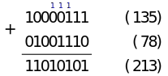

<style>
    section {
        font-size: 30px;
    }

    h1 {
        font-size: 70px;
    }
</style>

<!-- _class: lead -->
# Matemática

*__Representação Binária__*

Prof. Edson Alves
Faculdade UnB Gama

## Representação em base decimal

- A representação de número $n$, em base decimal, consiste na concatenação de $k + 1$ coeficientes $c_i$ tais que
$$
n = c_0 + c_1\cdot 10 + c_2\cdot 10^2 + \ldots + c_k\cdot 10^k
$$

- Por exemplo,
$$
            2507 = 7 + 0\cdot 10 + 5\cdot 10^2 + 7\cdot 10^3
$$

## Representação em uma base arbitrária

- De forma geral, a representação de $n$ em base $b > 1$ é a concatenação de $k + 1$ coeficientes $a_j$ tais que
$$
n = a_0 + a_1\cdot b + a_2\cdot b^2 + \ldots + a_k\cdot b^k
$$

- A representação de qualquer inteiro $n$ em base $b$ é única

- Esta representação $R$ de $n$ em base $b$ pode ser obtida usando-se recursão e o algoritmo de Euclides: $R(n) = R(q)b + r$, onde $n = bq + r, 0 \leq r < b$

## Representação em base arbitrária

```C++
const string digits { "0123456789ABCDEFGHIJKLMNOPQRSTUVWXYZ" };

string representation(int n, int b)
{
    string rep;

    do {
        rep.push_back(digits[n % b]);
        n /= b;
    } while (n);

    reverse(rep.begin(), rep.end());

    return rep;
}
```

## Conversão entre bases

- A conversão de uma representação em base $a$ para uma base $b$ é, em geral, feita em duas etapas:
    1. conversão da base $a$ para uma base pré-determinada (base 10 ou 2, por exemplo);
    1. conversão desta base pré-determinada para a base $b$.

- A primeira etapa é realizada por meio da expansão da representação do número em base $a$

- Esta expansão pode ser realizada em $O(k)$ por meio do algoritmo de Horner

- A segunda é feita por meio da rotina de geração de representação já mencionada

## Conversão para base decimal

```C++
long long to_decimal(const string& rep, long long base)
{
    long long n = 0;

    for (auto c : rep)
    {
        n *= base;
        n += digits.find(c);
    }

    return n;
}   
```

## Representação em base binária

- A base $b = 2$ é a menor e mais simples dentre todas as bases positivas

- Os únicos dois dígitos possíveis em $R(n)$ são `0` e `1`

- Internamente, os computadores armazenam números inteiros em sua representação binária

- É possível comparar diretamente dois números em base binária, sem a necessidade de convertê-los para a base decimal

## Representação em base binária

- Para isso, uma vez alinhados o número de dígitos (com zeros à esquerda, se necessário), vale a comparação lexicográfica

- Do mesmo modo, é possível somar diretamente dois números em base binária

- Uma vez alinhados, a soma de dígitos distintos resulta em `1`; a soma de dois zeros é `0`; a soma de dois uns resulta em `0` e um novo `1` é adicionado à próxima posição (vai um, _carry_)

## Visualização da soma em base binária



## _Overflow_

- Nas linguagens de programação, o número de _bits_ usados na representação de inteiros é limitado

- Por exemplo, em C/C++, variáveis do tipo `int`  ocupam, em geral, 32 _bits_ (o mesmo espaço em memória que uma palavra do processador)

- Variáveis `long long`, em geral, ocupam 64 _bits_

- Esta limitação de espaço pode levar ao _overflow_: quando o limite é atingido, os _bits_ que excedem o tamanho máximo "transbordam", ficando apenas aqueles que se encontram dentro do limite de espaço

- O _overflow_ pode levar a resultados inesperados, e deve ser tratado com cuidado e atenção

## Visualização do _overflow_ em variáveis de 8 _bits_


## Representação binária de números negativos

- Para representar número negativos, utiliza-se o fato de que $n + (-n) = 0$

- Assim, a representação de $-n$ seria um número tal que, somado com $n$, daria resto zero

- Devido ao _overflow_, tal número existe e é denominado complemento de dois de $n$

- Por exemplo, em variáveis de 8 _bits_ de tamanho, o complemento de dois de $77$ é $179$, pois $77 + 179 = 256 = 0$

## Representação binária de números negativos

- O complemento de dois pode ser obtido diretamente, sem necessidade de uma subtração

- Basta inverter os _bits_ da representação binária de $n$ e somar um ao resultado

- Desta maneira, o _bit_ mais significativo diferencia os números positivos (zero) dos negativos (um)


## Visualização do complemento de dois de $77$


## Problemas

- Codeforces
    1. [258A - Little Elephant and Bits](https://codeforces.com/problemset/problem/258/A)
    1. [1338B - Captain Flint and a Long Voyage](https://codeforces.com/problemset/problem/1388/B)
- OJ
    1. [343 - What Base is This?](http://onlinejudge.org/index.php?option=com_onlinejudge&Itemid=8&category=24&page=show_problem&problem=279)
    1. [355 - The Bases are Loaded](http://onlinejudge.org/index.php?option=com_onlinejudge&Itemid=8&category=24&page=show_problem&problem=291)
    1. [11185 - Ternary](http://onlinejudge.org/index.php?option=com_onlinejudge&Itemid=8&category=24&page=show_problem&problem=2126)

## Referências

1. **HALIM**, Felix; **HALIM**, Steve. _Competitive Programming 3_, 2010.
1. **LAAKSONEN**, Antti. _Competitive Programmer's Handbook_, 2018.
1. **SKIENA**, Steven S.; **REVILLA**, Miguel A. _Programming Challenges_, 2003.
