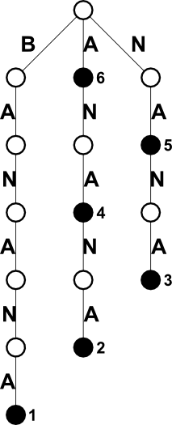
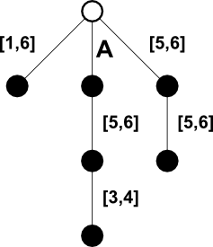

Árvores de Sufixos
==================

Árvores de sufixos são estruturas de dados que representam o conjunto 
`S(text)` de todas as
substrings de uma string `text` dada. A relação de pertinência (`s` 
pertence a `S(text)`?) é o mais básico problema associado a esta estrutura, e
uma "boa" árvore de sufixos tem três características fundamentais:

1. pode ser construída com tamanho linear;
1. pode ser construída em tempo linear;
1. pode responder questão de pertinência em complexidade linear em relação ao
tamanho de `s`.

Definições 
----------

Seja `G` um grafo acíclico direcionado, com raiz, cujas arestas `e` recebem,
como rótulos, caracateres ou palavras de um alfabeto `A` de tamanho constante.
Seja `label(e)` o rótulo de `e`. O rótulo de um caminho `p` é a concatenação
dos rótulos de todas as arestas do caminho.

Tal grafo representa um conjunto de strings definidas pelos rótulos 
de todos os caminhos possíveis em `G`. Defina

        Labels(G) = {label(p): p é caminho em G com início na raiz}

Diremos que `G` representa todas as substrings de `text` se `Labels(G) = S(text)`.

Um nó `n` cujo caminho da raiz até `n` tem como rótulo um sufixo de `text` é 
denominado **nó essencial**.

Tries
-----

**Trie de substrings**, ou simplesmente **trie**, é um grafo `G`, como acima 
definido, cujos rótulos consistem apenas de um único caractere. A figura abaixo
ilustra a trie da palavra "BANANA": os nós pretos são nós essenciais, e os
números ao lado dos nós essenciais são os índices do caractere inicial do
sufixo.



A função abaixo constrói uma _trie_: os nós são mapas onde a chave é o 
rótulo da aresta e o valor é o índice do nó.
```C++
#define MAX 1000010

map<char, int> trie[MAX];

void build_naive(const string& s)
{
    for (int i = 0; i < MAX; ++i)
        trie[i].clear();

    int root = 0, next = 0;

    for (int i = s.size() - 1; i >= 0; --i)
    {
        string suffix = s.substr(i);
        int v = root;

        for (auto c : suffix)
        {
            auto it = trie[v].find(c);

            if (it != trie[v].end())
            {
                v = it->second;
            }else
            {
                trie[v][c] = ++next;
                v = next;
            }
        }
    }
}
```

Observe que é possível usar esta trie para identificar se uma string `s` é ou
não substring de "BANANA", bastando proceder de forma semelhante à busca binária.
Para `s = "NAN"`, partindo da raiz, temos "N" na aresta à direita, "A" na única
aresta e "N" na aresta seguinte: logo `s` é substring. Como o nó de chegada é
branco, a substring não é sufixo. Para `s = "NAS"`, o último caractere ("S")
não seria encontrado; o mesmo para `s = "MAS"`, onde a falha acontece logo no
primeiro caractere. Para `s = "NANAN"`, a busca se encerraria por chegar em um
nó nulo. Observe que esta busca tem complexidada `O(|s|)`, 
atendendo um dos critérios de uma boa árvore de sufixos.

Abaixo uma possível implementação desta busca em C++.
```C++
bool trie_search(const string& s)
{
    int v = 0;
    size_t pos = 0;

    while (pos < s.size())
    {
        auto it = trie[v].find(s[pos]);

        if (it == trie[v].end())
            return false;

        ++pos;
        v = it->second;
    }

    return true;
}
```

Note que a busca acima apenas determina se a substring `s` ocorre ou não na _trie_, mas como só temos uma palavra na trie, se a substring `s` ocorre ou não em `text`.
Se for preciso determinar a posição (ou posições) desta ocorrência, é preciso
modificar a construção da _trie_, para discriminar os nós que são essenciais dos
demais.

Uma maneira simples de fazê-lo é adicionar um caractere terminador (em geral,
`#`), que não pertença a string original. A este caractere estará associado o
índice `i` da string tal que o sufixo terminado no marcador é igual a 
`text[i..N]`.
```C++
void build_naive_with_marker(const string& s)
{
    for (int i = 0; i < MAX; ++i)
        trie[i].clear();

    int root = 0, next = 0;

    for (int i = s.size() - 1; i >= 0; --i)
    {
        string suffix = s.substr(i) + "#";
        int v = root;

        for (auto c : suffix)
        {
            if (c == '#')
            {
                trie[v]['#'] = i;
                break;
            }

            auto it = trie[v].find(c);

            if (it != trie[v].end())
            {
                v = it->second;
            }else
            {
                trie[v][c] = ++next;
                v = next;
            }
        }
    }
}
```

Com os marcadores, é possível extrair um vetor com os índices de todas as
ocorrências de uma substring `s` na _trie_, ou no caso, em `text`. Se o vetor retornar vazio, a substring s não ocorre
na _trie_.

```C++
vector<int> trie_search_positions(const string& s)
{
    int v = 0;
    size_t pos = 0;
    vector<int> positions;

    while (pos < s.size())
    {
        auto it = trie[v].find(s[pos]);

        if (it == trie[v].end())
            return positions;

        ++pos;
        v = it->second;
    }

    queue<int> q;
    q.push(v);

    while (not q.empty())
    {
        auto u = q.front();
        q.pop();

        for (auto p : trie[u])
        {
            auto c = p.first;
            auto v = p.second;

            if (c == '#')
                positions.push_back(v);
            else
                q.push(v);
        }
    }

    return positions;
}
```

Outra informação que pode ser obtida a partir da _trie_ é o número de 
substring distintas de `text`. Sabemos que, se `|text| = n`, `text` tem `n(n + 1)/2`
substrings não vazias, não necessariamente distintas 
(em outras palavras, todas as combinações de índices `i, j`, com 
`i <= j, i, j = 1, 2, ..., n`, com repetição. Na _trie_, qualquer nó, exceto a
raiz, representa uma substring distinta: os rótulos do caminho da raiz até o
nó.

O código abaixo computa o número de substrings distintas de uma string, a 
partir de sua _trie_ pré-computada.
```C++
size_t unique_substrings()
{
    queue<int> q;
    q.push(0);
    int count = 0;

    while (not q.empty())
    {
        auto u = q.front();
        q.pop();

        for (auto p : trie[u])
        {
            auto c = p.first;
            auto v = p.second;

            if (c != '#')
            {
                ++count;
                q.push(v);
            }
        }
    }    

    return count;
}
```

Embora as buscas apresentadas satisfaçam o terceiro critério para uma boa 
árvore de sufixo,
os outros dois critérios não são satisfeitos: se a string inicial tem
`N` caracteres, a construção e o espaço em memória são `O(N^2)`.

A melhoria da construção e do espaço em memória da _trie_ são abordados nas
próximas seções.

Construção Online da Trie 
-------------------------

A construção pode ser melhorada se, ao invés de construir toda a `Trie(s)` de uma só vez,
computamos `Trie(s[1..N])` a partir de `Trie(s[1..(N - 1)]`. Defina `Tj = Trie(s[1..j])`.

A principal observação a ser feita é que `Tj` pode ser construída a partir da inserção do 
caractere `s[j]` em `T(j - 1)`, nas arestas de novos nós a serem adicionados no nós essenciais 
de `T(j - 1)`, quando for o caso (isto é, quando o nó essencial não tem um filho cuja aresta
tem `s[j]` como rótulo).

O ponto principal, portanto, se torna determinar a sequência dos nós essenciais 
`v_k, v_(k-1), ..., v_2, v_1, v_0`, onde `v_i` corresponde ao prefixo `s[1..i]` de `Tk`. 
Esta tarefa pode ser feita por meio do uso de _links_ de sufixos.

Seja `u` um nó de `Tk`. Defina `suf[u] = v`, onde `v` é um nó cujo caminho `p(v)` da raiz até 
`v` é igual ao caminho de `[2..p(u)]`, isto é, o caminho `p(u)` sem o seu primeiro caractere. 
Por definição, `suf[root] = root` (embora interpretar `suf[root] = NULL` seja mais interessante
para a implementação). Esta definição nos leva a importante igualdade:

        (v_k, v_(k-1), ..., v_0) = (v_k, suf[v_k], suf^2[v_k], ..., suf^{k - 1}[v_k])
    

Então a construção _online_ de `Tk` a partir de `T(k-1)` pode ser feita por meio dos passos
a seguir:

1. identifique os nós essenciais `v_(k-1), v_(k-2), ..., v_1, v_0` de `T(k-1)`, em ordem 
decrescente em relação ao tamanho do sufixo relacionado;
1. escolha os `v_i` consecutivos até que se tenha um nó `v_t` tal que exista um filho de
`v_t` cuja aresta é `s[k]`;
1. para os nós escolhidos, crie novos nós filhos cujos arestas sejam `s[k]`;
1. atualize os _links_ de sufixos para os novos nós criados.

Uma possível implementação deste algoritmo em C++ é dada a seguir.
```C++
void build_online(const string& s)
{
    for (int i = 0; i < MAX; ++i)
        trie[i].clear();

    int root = 0, next = 0, deepest = 0;        // deepest = v_(k-1)
    string S = s + '#';
    vector<int> suf { -1 };                     // suf[root] = NULL

    for (size_t i = 0; i < S.size(); ++i)
    {
        // Calculo de Tk, com k = i + 1

        int c = S[i];
        int u = deepest;

        while (u >= 0)
        {
            auto it = trie[u].find(c);

            if (it == trie[u].end())
            {
                trie[u][c] = ++next;
                suf.push_back(0);               // lazy: will be corrected in next loop

                if (u != deepest)
                {
                    suf[next - 1] = next;       // delayed correction
                } else
                    deepest = next;             // v_k is the newest created node
            } else
            {
                // Corner case: if s[k] is found, suf[v_t] points to it
                suf[next] = it->second;
                break;
            }

            u = suf[u];                         // v_(r-1) = suf[v_r]
        }
    }        
}
```

Veja que, na implementação acima, os valores `v_k` são usandos implicitamente. 
Para uma string `s` de tamanho `n`, esta construção tem complexidade `O(|Tn|)`.
Embora ainda não seja a complexidade desejada de `O(n)`, esta estratégia será utilizada,
com alguns ajustes, para atingir tal complexidade na construção da _suffix tree_, que
veremos a seguir.

Para reduzir o tamanho em memória da _trie_ uma estratégia possível é compactar
as **cadeias**, onde uma **cadeia** é o maior caminho possível composto por
nós não-essenciais com grau de saída um (isto é, com uma única aresta partindo
do nó). Esta compactação resulta em uma _suffix tree_.

Suffix Tree
-----------

Conforme dito anteriormente, uma _suffix tree_ é a estrutura resultante da
compactação das cadeias de uma trie. A string resultante da compactação do
caminho `p` é descrita por uma par de índices `[i,j]`, de modo que 
`label(p) = text[i..j]`, sendo que pode haver mais de uma escolha possível para
tais índices.

A figura abaixo ilustra a _suffix tree_ associada a trie anterior.



Observe que agora, exceto a raiz, todos os nós são essenciais, de modo que o
armazenamento agora é proporcional ao número de suffixos, e como uma string
`text` tem `|text|` sufixos, o espaço em memória é linear em relação ao tamanho da
string, uma redução significativa em relação às _tries_.

## Vídeos Sugeridos

[Trie, by Tushar Roy](https://www.youtube.com/watch?v=AXjmTQ8LEoI)


### Referências

HALIM, Steve; HALIM, Felix. [Competitive Programming 3](http://cpbook.net/), Lulu, 2013.

CROCHEMORE, Maxime; RYTTER, Wojciech. [Jewels of Stringology: Text Algorithms](http://site.ebrary.com/lib/univbrasilia/reader.action?docID=10201155), WSPC, 2002.
