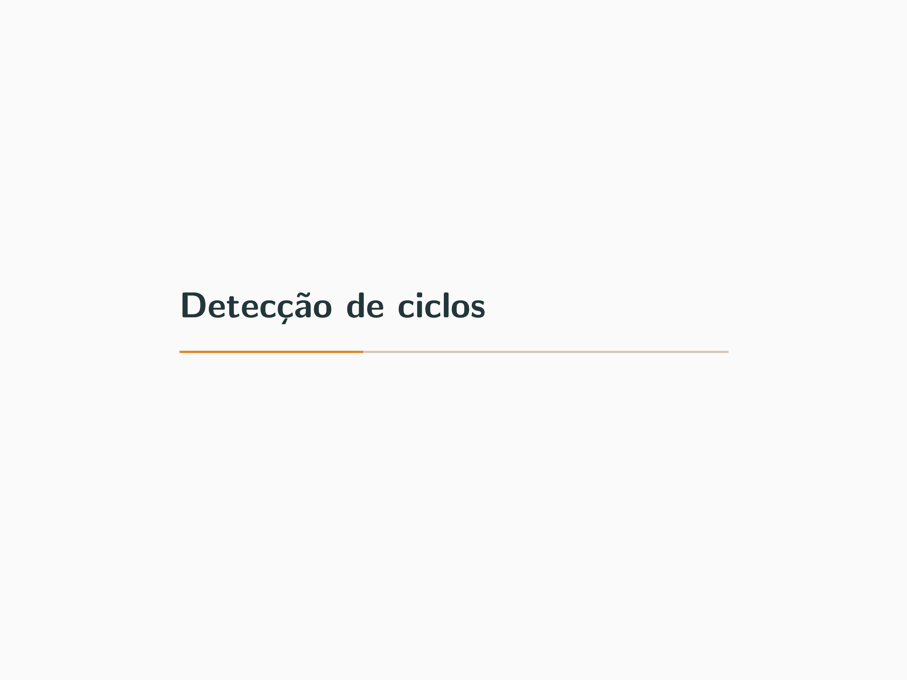

## Faculdade UnB Gama
Sumário
1. Componentes Conectados
2. Detecção de ciclos
3. Grafos Bipartidos
## Componentes Conectados
Conectividade de um grafo
* Um grafo não-direcionado G é dito conectado se, para qualquer par
de vértices u, v ∈ G , com u 6= v , existe ao menos um caminho de u
até v
* Uma maneira de se verificar se um grafo é conectado ou não é
iniciar uma travessia em um vértice s qualquer
* Se a travessia visitar todos os N nós de G o grafo é conectado
* Caso um ou mais vértices não seja visitado, os nós visitados formam
um componente conectado de G
* Para identificar todos os componentes conectados do grafo basta
iniciar uma nova travessia em um dos vértices não visitados,
enquanto houverem vértices não visitados
##  Visualização da identificação dos componentes conectados

Para acessar álbum de imagens [clique aqui](images/vis-0/).

## Implementação da identificação dos componentes em C++
```C++
#include <iostream>
#include <vector>
#include <bitset>
using namespace std;
using ii = pair<int, int>;
const int MAX { 100010 };
bitset<MAX> visited;
vector<int> adj[MAX];
void dfs(int u)
{
    if (visited[u]) return;
    visited[u] = true;
    cout << " " << u;
    for (const auto& v : adj[u])
        dfs(v);
}
int connected_components(int N)
{
    visited.reset();
    int ans = 0;
    for (int u = 1; u <= N; ++u)
    {
        if (not visited[u])
        {
            cout << "Component " << ++ans << ":";
            dfs(u);
            cout << endl;
        }
    }
    return ans;
}
int main()
{
    ii edges[] { ii(1, 2), ii(1, 8), ii(2, 10), ii(3, 7), ii(4, 5),
                 ii(4, 9), ii(5, 9)
               };
    for (const auto& [u, v] : edges)
    {
        adj[u].push_back(v);
        adj[v].push_back(u);
    }
    connected_components(10);
    return 0;
}
```
## Detecção de ciclos
* Um ciclo é um caminho de tamanho maior ou igual a três cujos
pontos de partida e chegada são iguais
* Um grafo que não contém nenhum ciclo é dito acíclico
* Uma travessia por profundidade pode ser utilizada para se
determinar se um componente de um grafo é ou não acíclico
* Se, durante a travessia, um dos vizinhos do nó já foi visitado, e este
vizinho não é o nó que o antecedeu na busca, então existe um ciclo
começando e terminando no nó atual, e que passa por este vizinho
* Outra maneira de se detectar ciclos é contar o número de arestas E
e vértices V do componente: se E > V − 1 então o componente
tem um ciclo
* A complexidade da detecção de ciclos é a mesma da travessia:
O(N + M), onde N é o número de nós e M o número de arestas do
grafo
##  Visualização da identificação de ciclos

Para acessar álbum de imagens [clique aqui](images/vis-1/).

## Exemplo de detecção de ciclo
```C++
#include <iostream>
#include <cstring>
#include <bitset>
#include <vector>
using namespace std;
using ii = pair<int, int>;
const int MAX { 100010 };
bitset<MAX> visited;
vector<int> adj[MAX];
int parent[MAX];
bool dfs(int u)
{
    if (visited[u]) return false;
    visited[u] = true;
    for (const auto& v : adj[u])
    {
        parent[v] = parent[v] ? parent[v] : u;
        if (visited[v] and parent[u] != v)
            return true;
        else if (dfs(v)) return true;
    }
    return false;
}
bool has_cycle(int N)
{
    visited.reset();
    memset(parent, 0, sizeof parent);
    for (int u = 1; u <= N; ++u)
        if (not visited[u] and dfs(u))
            return true;
    return false;
}
int main()
{
    ii edges[] { ii(1,2), ii(2,3), ii(2,4), ii(2,6), ii(4,5), ii(4,6) };
    for (const auto& [u, v] : edges)
    {
        adj[u].push_back(v);
        adj[v].push_back(u);
    }
    cout << "Tem ciclo? " << (has_cycle(6) ? "Sim" : "Nao") << endl;
    return 0;
}
```
## Outro exemplo de detecção de ciclo
```C++
#include <iostream>
#include <functional>
#include <vector>
#include <bitset>
using namespace std;
using ii = pair<int, int>;
const int MAX { 100010 };
bitset<MAX> visited;
vector<int> adj[MAX];
void dfs(int u, function<void(int)> process) {
    if (visited[u]) return;
    visited[u] = true;
    process(u);
    for (const auto& v : adj[u])
        dfs(v, process);
}
bool has_cycle(int N) {
    visited.reset();
    for (int u = 1; u <= N; ++u)
        if (not visited[u])
        {
            vector<int> cs;
            size_t edges = 0;
            dfs(u, [&](int u) {
                cs.push_back(u);
                for (const auto& v : adj[u])
                    edges += (visited[v] ? 0 : 1);
            });
            if (edges >= cs.size()) return true;
        }
    return false;
}
int main()
{
    ii edges[] { ii(1,2), ii(2,3), ii(2,4), ii(2,6), ii(4,5), ii(4,6) };
    for (const auto& [u, v] : edges)
    {
        adj[u].push_back(v);
        adj[v].push_back(u);
    }
    cout << "Tem ciclo? " << (has_cycle(6) ? "Sim" : "Nao") << endl;
    return 0;
}
```
## Grafos Bipartidos
Definição
* Um grafo é dito bipartido se todos os seus vértices podem ser
coloridos usando apenas duas cores, de modo que todos os pares de
vértices vizinhos tenham cores distintas
* Tanto a DFS quanto a BFS podem ser utilizadas para verificar se
um grafo é bipartido ou não
* Inicialmente todos os nós não tem cores atribuídas a eles, e o ponto
de partida da travessia recebe uma cor (por exemplo, azul)
* A travessia continua nos seus vizinhos, que devem receber a cor
oposta (por exemplo, vermelho)
* Se a travessia atingir um nó já colorido, e a cor dele for a mesma do
nó que o antecedeu na travessia, o grafo não é bipartido
* Uma propriedade interessante dos grafos bipartidos é que eles não
podem ter ciclos de tamanho ı́mpar
##  Visualização da identificação de grafos bipartidos

Para acessar álbum de imagens [clique aqui](images/vis-2/).

## Implementação da verificação em C++
```C++
#include <bits/stdc++.h>
using namespace std;
using ii = pair<int, int>;
const int MAX { 100010 }, NONE = 0, BLUE = 1, RED = 2;
int color[MAX];
vector<int> adj[MAX];
bool bfs(int s)
{
    queue<int> q;
    q.push(s);
    color[s] = BLUE;
    while (not q.empty())
    {
        auto u = q.front();
        q.pop();
        for (const auto& v : adj[u])
            if (color[v] == NONE)
            {
                color[v] = 3 - color[u];
                q.push(v);
            } else if (color[v] == color[u])
                return false;
    }
    return true;
}
bool is_bipartite(int N)
{
    for (int u = 1; u <= N; ++u)
        if (color[u] == NONE and not bfs(u))
            return false;
    return true;
}
int main()
{
    ii edges[] { ii(1, 2), ii(1, 3), ii(1, 4), ii(1, 5), ii(2, 6),
                 ii(3, 6), ii(4, 8), ii(5, 7), ii(6, 9), ii(7, 9), ii(8, 9),
                 ii(9, 10)
               };
    for (const auto& [u, v] : edges)
    {
        adj[u].push_back(v);
        adj[v].push_back(u);
    }
    cout << (is_bipartite(10) ? "Sim" : "Nao") << endl;
    return 0;
}
```
## Referências
1. HALIM, Felix; HALIM, Steve. Competitive Programming 3, 2010.
2. LAAKSONEN, Antti. Competitive Programmer’s Handbook, 2018.
3. SKIENA, Steven S.; REVILLA, Miguel A. Programming
Challenges, 2003.

## Lista de Exercicios - Bipartite
* Bipartite1, https://a2oj.com/category?ID=58
